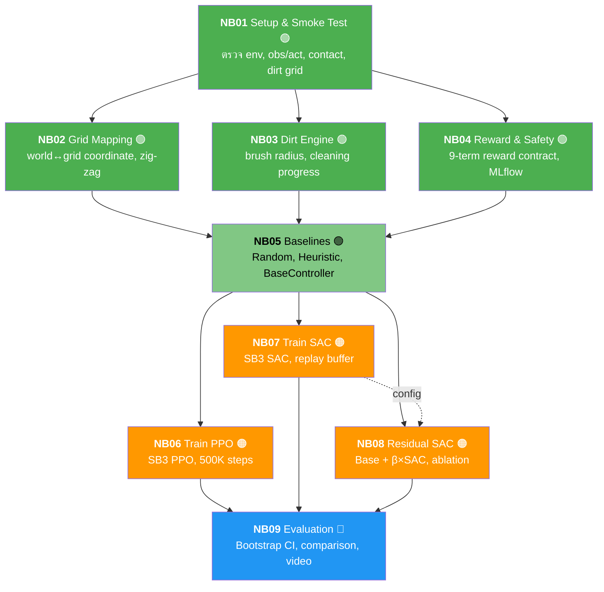

# 🤖 Unitree G1 DishWipe — Robotic Simulation with RL

> **สอนหุ่นยนต์ Unitree G1 ล้างจานในอ่างล้างจาน** ด้วย Reinforcement Learning  
> ManiSkill 3 + SAPIEN + Stable-Baselines3 | PPO vs SAC vs Residual SAC

---

## ภาพรวมโปรเจกต์

โปรเจกต์นี้สร้าง **custom simulation environment** สำหรับหุ่นยนต์ Unitree G1 (ครึ่งบน, 25 DOF) ให้ทำภารกิจ **เช็ดจาน** ในครัวจำลอง โดยใช้ [ManiSkill 3](https://github.com/haosulab/ManiSkill) + [SAPIEN](https://sapien.ucsd.edu/) สำหรับ physics simulation และเปรียบเทียบ 3 วิธี Reinforcement Learning:

- **PPO** (Proximal Policy Optimization) — on-policy, เสถียร, ใช้ vectorized env
- **SAC** (Soft Actor-Critic) — off-policy, sample efficient, ใช้ replay buffer
- **Residual SAC** — SAC ต่อยอดจาก heuristic controller, เรียนเร็วที่สุด

ระบบประเมินผลด้วย **Bootstrap 95% CI** บน metrics: success rate, cleaned ratio, jerk, safety violations

---

## สารบัญ

- [Quickstart (Local CPU)](#quickstart-local-cpu)
- [Quickstart (RunPod GPU)](#quickstart-runpod-gpu)
- [Notebook Pipeline (NB01–NB09)](#notebook-pipeline-nb01nb09)
- [โครงสร้างโปรเจกต์](#โครงสร้างโปรเจกต์)
- [เอกสารละเอียด (docs/)](#เอกสารละเอียด-docs)
- [Hardware Requirements](#hardware-requirements)
- [Tech Stack](#tech-stack)
- [License](#license)

---

## Quickstart (Local CPU)

> เหมาะสำหรับ NB01–NB05 (ตั้งค่า, ทดสอบ env, baselines) — ไม่ต้องมี GPU

```powershell
# 1. Clone repository
git clone https://github.com/siriponsri/robotic-sim-dishwash.git
cd robotic-sim-dishwash

# 2. สร้าง virtual environment
python -m venv .env

# 3. Activate (Windows)
.env\Scripts\Activate.ps1
# macOS/Linux: source .env/bin/activate

# 4. ติดตั้ง dependencies
python -m pip install --upgrade pip
python -m pip install -r requirements.runpod.txt

# 5. ตรวจว่าทุกอย่างพร้อม
python scripts/runpod_verify.py

# 6. ตั้งค่า MLflow credentials
Copy-Item .env.example .env.local
# แก้ .env.local ใส่ MLFLOW_TRACKING_URI, USERNAME, PASSWORD

# 7. เปิด VS Code → เลือก interpreter → .env/Scripts/python.exe
# 8. เปิด notebooks/NB01_setup_smoke.ipynb → Run All
# 9. ต้องเห็น: obs [1, 168], act (25,), Smoke test PASSED
# 10. รัน NB02 → NB03 → NB04 → NB05 ตามลำดับ
```

> 📖 ดูรายละเอียดเพิ่มเติมที่ [docs/01_repo_setup_local.md](docs/01_repo_setup_local.md)

---

## Quickstart (RunPod GPU)

> จำเป็นสำหรับ NB06–NB08 (Training PPO/SAC/Residual SAC)

```bash
# 1.  สมัคร RunPod → เติมเงิน $10-20
# 2.  สร้าง SSH key
ssh-keygen -t ed25519 -C "your_email@example.com"

# 3.  เพิ่ม public key ลง RunPod Settings → SSH Keys
# 4.  สร้าง Pod: RTX 4090, PyTorch 2.x template, 50GB disk
# 5.  รอ Pod Running → Copy SSH command

# 6.  SSH เข้า Pod
ssh root@<IP> -p <PORT> -i ~/.ssh/id_ed25519

# 7.  Clone และ setup
cd /workspace
git clone https://github.com/siriponsri/robotic-sim-dishwash.git
cd robotic-sim-dishwash
bash scripts/runpod_setup.sh /workspace/robotic-sim-dishwash

# 8.  ตั้งค่า MLflow
cp .env.example .env.local
nano .env.local  # ใส่ credentials

# 9.  ตรวจ GPU
python -c "import torch; print(torch.cuda.get_device_name(0))"

# 10. ใช้ VS Code Remote-SSH ต่อเข้า Pod
#     เพิ่มใน ~/.ssh/config:
#       Host runpod
#         HostName <IP>
#         Port <PORT>
#         User root
#         IdentityFile ~/.ssh/id_ed25519

# 11. รัน NB01 (smoke test บน GPU)
# 12. รัน NB05 (baselines — ต้องมี BaseController สำหรับ NB08)
# 13. รัน NB06 (PPO training ~ 1-3 ชม.)
# 14. รัน NB07 (SAC training ~ 1-3 ชม.)
# 15. รัน NB08 (Residual SAC ~ 3-6 ชม.)
# 16. รัน NB09 (Evaluation + comparison)
```

> 📖 ดูรายละเอียดเพิ่มเติมที่ [docs/02_runpod_setup.md](docs/02_runpod_setup.md)

---

## Notebook Pipeline (NB01–NB09)



> 🟢 CPU ทำได้ &nbsp; 🟠 ต้องใช้ GPU &nbsp; 🔵 CPU/GPU

| NB | ชื่อ | Output หลัก | Runtime (GPU) |
|----|------|-------------|---------------|
| 01 | Setup & Smoke | `env_spec.json` | 1 นาที |
| 02 | Grid Mapping | `grid_trace.csv`, `grid_*.png` | 1 นาที |
| 03 | Dirt Engine | `brush_effect_demo.png` | 1 นาที |
| 04 | Reward & Safety | `reward_contract.json` | 1 นาที |
| 05 | Baselines | `baseline_leaderboard.csv` | 5 นาที |
| 06 | Train PPO | `ppo_model.zip` | 1–3 ชม. |
| 07 | Train SAC | `sac_model.zip` | 1–3 ชม. |
| 08 | Residual SAC | `residual_sac_beta*.zip` | 3–6 ชม. |
| 09 | Evaluation | `eval_table.csv`, `eval_comparison.png` | 15 นาที |

---

## โครงสร้างโปรเจกต์

```
robotic-sim-dishwash/
├── README.md                    ← 📍 คุณอยู่ที่นี่
├── docs/                        ← เอกสารละเอียด (ภาษาไทย)
├── notebooks/                   ← Jupyter notebooks (NB01–NB09)
├── src/envs/                    ← Custom ManiSkill environment
│   ├── dishwipe_env.py          ← UnitreeG1DishWipe-v1 (~580 lines)
│   ├── dirt_grid.py             ← VirtualDirtGrid (10×10)
│   └── __init__.py
├── scripts/                     ← Setup scripts
│   ├── runpod_setup.sh
│   └── runpod_verify.py
├── artifacts/                   ← ผลลัพธ์จากแต่ละ NB (auto-generated)
├── .env.example                 ← Template สำหรับ MLflow credentials
├── .gitignore
└── requirements.runpod.txt      ← Dependencies
```

---

## เอกสารละเอียด (docs/)

| # | เอกสาร | เนื้อหา |
|---|--------|---------|
| 00 | [ภาพรวมโปรเจกต์](docs/00_project_overview.md) | Big picture, NB01–09 table, fairness, architecture |
| 01 | [Setup Local](docs/01_repo_setup_local.md) | venv, pip install, VS Code, .env.local, troubleshoot |
| 02 | [Setup RunPod](docs/02_runpod_setup.md) | SSH key, Pod สร้าง, VS Code Remote, GPU check |
| 03 | [Environment & Task](docs/03_environment_and_task.md) | dishwipe_env.py, dirt_grid.py, reward 9 terms, contact multi-link |
| 04 | [คู่มือ Notebook](docs/04_notebook_guide.md) | รายละเอียดทุก NB: input/output/config/pitfalls |
| 05 | [RL Methods Tutorial](docs/05_rl_methods_tutorial.md) | PPO, SAC, Residual Policy อธิบายแบบเข้าใจง่าย |
| 06 | [Experiment Tracking](docs/06_experiment_tracking.md) | MLflow setup, naming conventions, CSV fallback |
| 07 | [Evaluation & Reporting](docs/07_evaluation_and_reporting.md) | NB09 pipeline, bootstrap CI, comparison plots |

---

## Hardware Requirements

| Component | NB01–NB05 (CPU) | NB06–NB08 (Training) | NB09 (Eval) |
|-----------|-----------------|----------------------|-------------|
| CPU | 2+ cores | 8+ cores | 4+ cores |
| RAM | 4 GB | 16+ GB | 8+ GB |
| GPU | - | RTX 3090+ (24 GB) | Optional |
| Storage | 5 GB | 50 GB | 10 GB |

> **RunPod แนะนำ**: RTX 4090 / 16 CPU cores / 64 GB RAM / 50 GB disk

---

## Tech Stack

| Component | Version | หน้าที่ |
|-----------|---------|---------|
| Python | 3.11–3.14 | Runtime |
| ManiSkill | 3.0.0b22 | Robotics simulation framework |
| SAPIEN | 3.0.2 | Physics engine |
| PyTorch | 2.10.0 | Neural network backend |
| Stable-Baselines3 | 2.7.0 | RL algorithms (PPO, SAC) |
| Gymnasium | 0.29.1 | Env interface standard |
| MLflow | 3.10+ | Experiment tracking |
| NumPy | 2.4.2 | Numerical computing |
| Matplotlib | 3.10.8 | Plotting |

---

## ข้อควรระวังสำคัญ

- ⚠️ **ห้ามใส่ secrets/token ลงใน code หรือ commit ขึ้น Git** — ใช้ `.env.local` + `.gitignore`
- ⚠️ **ห้ามกด "Run All" บน NB06–NB08 บน CPU** — จะใช้เวลานานมาก
- ⚠️ **Render จะ fail บน CPU-only** — นี่คือพฤติกรรมปกติ ไม่ใช่ bug
- ⚠️ **ต้อง import `UnitreeG1DishWipeEnv` ก่อน `gym.make()`** — ถ้าลืมจะ NameNotFound

---

## License

สงวนสิทธิ์สำหรับการศึกษาภายในทีม

---

*อัปเดตล่าสุด: มีนาคม 2026 | env v2 (plate in sink, multi-link contact, 9-term reward)*
