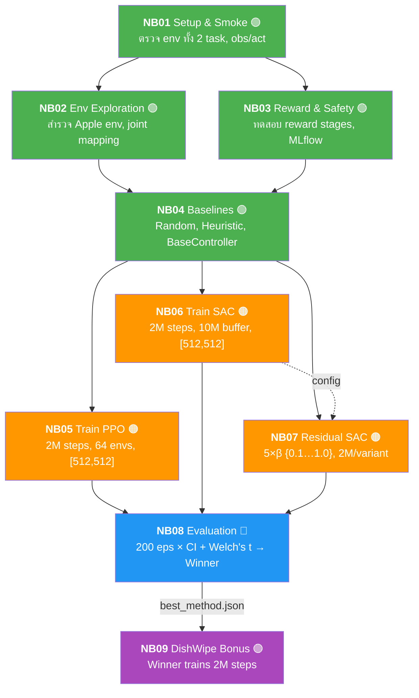

# 🤖 Unitree G1 Full-Body RL — Apple in Bowl + DishWipe

> **สอนหุ่นยนต์ Unitree G1 (เต็มตัว, 37 DOF)** หยิบแอปเปิลวางชาม + เช็ดจาน ด้วย Reinforcement Learning
> ManiSkill 3 + SAPIEN + Stable-Baselines3 | PPO vs SAC vs Residual SAC

---

## ภาพรวมโปรเจกต์

โปรเจกต์นี้สร้าง **custom simulation environment** สำหรับหุ่นยนต์ Unitree G1 **แบบเต็มตัว (Full Body, 37 DOF)** ที่ต้อง **ทรงตัว + ทำงานด้วยมือ** พร้อมกัน โดยใช้ [ManiSkill 3](https://github.com/haosulab/ManiSkill) + [SAPIEN](https://sapien.ucsd.edu/) สำหรับ physics simulation

### 2 Tasks

| Task | Role | คำอธิบาย |
|------|------|---------|
| **Apple in Bowl** | Main (NB01–NB08) | หยิบแอปเปิลวางลงชาม — ทรงตัว + เอื้อม + หยิบ + วาง |
| **DishWipe** | Bonus (NB09) | เช็ดจานในอ่างล้างจาน — ใช้เฉพาะ method ที่ชนะ |

### 3 RL Methods (เทียบบน Apple Task)

- **PPO** (Proximal Policy Optimization) — on-policy, vectorized env
- **SAC** (Soft Actor-Critic) — off-policy, sample efficient, replay buffer
- **Residual SAC** — SAC ต่อยอดจาก heuristic controller + β ablation

ระบบประเมินผลด้วย **Bootstrap 95% CI (50K resamples)** + **Welch's t-test** + **Cohen's d** บน 200 episodes → ประกาศผู้ชนะ → เทรนต่อบน DishWipe

---

## สารบัญ

- [Quickstart (Local CPU)](#quickstart-local-cpu)
- [Quickstart (RunPod GPU)](#quickstart-runpod-gpu)
- [Notebook Pipeline (NB01–NB09)](#notebook-pipeline-nb01nb09)
- [โครงสร้างโปรเจกต์](#โครงสร้างโปรเจกต์)
- [เอกสารละเอียด (docs/)](#เอกสารละเอียด-docs)
- [Hardware Requirements](#hardware-requirements)
- [Tech Stack](#tech-stack)

---

## Quickstart (Local CPU)

> สำหรับ NB01–NB04 (setup, exploration, baselines) — ไม่ต้องมี GPU

```powershell
# 1. Clone repository
git clone https://github.com/siriponsri/robotic-sim-dishwash.git
cd robotic-sim-dishwash

# 2. สร้าง virtual environment
python -m venv .env

# 3. Activate (Windows)
.env\Scripts\Activate.ps1
# macOS/Linux: source .env/bin/activate

# 4. ติดตั้ง dependencies
python -m pip install --upgrade pip
python -m pip install -r requirements.runpod.txt

# 5. ตรวจว่าทุกอย่างพร้อม
python scripts/runpod_verify.py

# 6. ตั้งค่า MLflow credentials
Copy-Item .env.example .env.local
# แก้ .env.local ใส่ MLFLOW_TRACKING_URI, USERNAME, PASSWORD

# 7. เปิด VS Code → เลือก interpreter → .env/Scripts/python.exe
# 8. เปิด notebooks/NB01_setup_smoke.ipynb → Run All
#    → ต้องเห็น: Apple obs ~110+, DishWipe obs ~200+, act (37,)
# 9. รัน NB02 → NB03 → NB04 ตามลำดับ
```

> 📖 ดูรายละเอียดเพิ่มเติมที่ [docs/01_repo_setup_local.md](docs/01_repo_setup_local.md)

---

## Quickstart (RunPod GPU)

> จำเป็นสำหรับ NB05–NB07 (Training PPO/SAC/Residual SAC) + NB09 (Bonus)
> **แนะนำ**: RTX 5090 (32 GB VRAM) / 40 GB RAM / 80 GB disk

### 1) สมัครและเตรียม RunPod

```
1. ไปที่ https://runpod.io → สมัคร → เติมเงิน $10-20
2. ที่ Settings → SSH Public Keys → เพิ่ม key ของคุณ (ดูขั้นตอนด้านล่าง)
```

### 2) สร้าง SSH Key (ถ้ายังไม่มี)

**Windows (PowerShell):**
```powershell
# สร้าง key pair (กด Enter 3 ครั้งเพื่อใช้ค่าเริ่มต้น)
ssh-keygen -t ed25519 -C "your_email@example.com"

# คัดลอก public key → นำไปวางที่ RunPod Settings → SSH Keys
Get-Content $env:USERPROFILE\.ssh\id_ed25519.pub | Set-Clipboard
# หรือ: cat ~/.ssh/id_ed25519.pub
```

**macOS / Linux:**
```bash
ssh-keygen -t ed25519 -C "your_email@example.com"
cat ~/.ssh/id_ed25519.pub | pbcopy   # macOS
# Linux: cat ~/.ssh/id_ed25519.pub | xclip -sel clip
```

> 💡 **id_ed25519** = private key (เก็บไว้ในเครื่อง), **id_ed25519.pub** = public key (วางที่ RunPod)

### 3) สร้าง Pod

```
1. RunPod → Deploy → GPU Cloud
2. เลือก GPU: RTX 5090 (32 GB VRAM)
3. Template: RunPod PyTorch 2.x
4. Disk: Container 20 GB + Volume 80 GB
5. กด Deploy
```

### 4) SSH เข้า Pod

เมื่อ Pod รัน → คัดลอก SSH command จาก RunPod dashboard:

**Windows (PowerShell):**
```powershell
# ตัวอย่าง — แทน IP และ PORT ตามที่ RunPod ให้
ssh root@123.45.67.89 -p 12345 -i $env:USERPROFILE\.ssh\id_ed25519
```

**macOS / Linux:**
```bash
ssh root@123.45.67.89 -p 12345 -i ~/.ssh/id_ed25519
```

> ⚡ **Tips**: ถ้าใช้ VS Code สามารถใช้ Remote - SSH extension:
> 1. `Ctrl+Shift+P` → "Remote-SSH: Connect to Host"
> 2. กรอก `ssh root@123.45.67.89 -p 12345 -i C:\Users\YOU\.ssh\id_ed25519`
> 3. เลือก Linux → VS Code จะเปิด remote workspace ได้เลย

### 5) Setup ใน Pod

```bash
# Clone repo
cd /workspace
git clone https://github.com/siriponsri/robotic-sim-dishwash.git
cd robotic-sim-dishwash

# ติดตั้ง dependencies + ตรวจ GPU
bash scripts/runpod_setup.sh /workspace/robotic-sim-dishwash
python -c "import torch; print(torch.cuda.get_device_name(0))"
# ต้องเห็น: NVIDIA GeForce RTX 5090

# ตั้งค่า MLflow
cp .env.example .env.local && nano .env.local
```

### 6) รัน Notebooks

```
NB01 (smoke test, 1 นาที) → NB02 (explore, 2 นาที) → NB03 (reward) → NB04 (baselines)
NB05 (PPO, ~2-4 ชม.) → NB06 (SAC, ~2-4 ชม.) → NB07 (Residual, ~10-20 ชม.)
NB08 (evaluate → declare winner, ~1-2 ชม.)
NB09 (bonus: winner trains DishWipe, ~2-4 ชม.)
```

> 📖 ดูรายละเอียดเพิ่มเติมที่ [docs/02_runpod_setup.md](docs/02_runpod_setup.md)

---

## Notebook Pipeline (NB01–NB09)



> 🟢 CPU | 🟠 GPU | 🔵 CPU/GPU | 🟣 Bonus GPU

| NB | ชื่อ | Task | Output หลัก | Runtime |
|----|------|------|-------------|---------|
| 01 | Setup & Smoke | Both | `env_spec.json`, `active_joints.json` | 1 นาที |
| 02 | Env Exploration | Apple | `env_exploration_trace.csv` | 2 นาที |
| 03 | Reward & Safety | Apple | `reward_contract.json` | 2 นาที |
| 04 | Baselines | Apple | `baseline_leaderboard.csv` | 5 นาที |
| 05 | Train PPO | Apple | `ppo_apple.zip` (2M, 64 envs, [512,512]) | 2–4 ชม. |
| 06 | Train SAC | Apple | `sac_apple.zip` (2M, 10M buffer, [512,512]) | 2–4 ชม. |
| 07 | Residual SAC | Apple | `residual_apple_beta*.zip` (5 β × 2M) | 10–20 ชม. |
| 08 | Evaluation | Apple | `best_method.json`, `stat_tests.json` (200 eps) | 1–2 ชม. |
| 09 | Bonus DishWipe | DishWipe | `{winner}_dishwipe.zip` (2M, cross-task) | 2–4 ชม. |

---

## โครงสร้างโปรเจกต์

```
robotic-sim/
├── README.md                    ← 📍 คุณอยู่ที่นี่
├── docs/                        ← เอกสารละเอียด (ภาษาไทย)
├── plan/                        ← แผนงานละเอียดแต่ละ NB
├── notebooks/                   ← Jupyter notebooks (NB01–NB09)
├── src/envs/                    ← Custom ManiSkill environments
│   ├── apple_fullbody_env.py    ← Apple Full-Body env (37 DOF)
│   ├── dishwipe_fullbody_env.py ← DishWipe Full-Body env (37 DOF)
│   ├── dishwipe_env.py          ← Original DishWipe upper body (reference)
│   ├── dirt_grid.py             ← VirtualDirtGrid (10×10)
│   └── __init__.py
├── scripts/                     ← Setup scripts
│   ├── runpod_setup.sh
│   └── runpod_verify.py
├── artifacts/                   ← ผลลัพธ์จากแต่ละ NB (auto-generated)
├── ref-code/                    ← Reference code (original lab)
├── .env.example                 ← Template สำหรับ MLflow credentials
└── requirements.runpod.txt      ← Dependencies
```

---

## เอกสารละเอียด (docs/)

| # | เอกสาร | เนื้อหา |
|---|--------|---------|
| 00 | [ภาพรวมโปรเจกต์](docs/00_project_overview.md) | 2 Tasks, pipeline, fairness, architecture |
| 01 | [Setup Local](docs/01_repo_setup_local.md) | venv, pip install, VS Code |
| 02 | [Setup RunPod](docs/02_runpod_setup.md) | SSH, Pod, GPU check |
| 03 | [Environment & Task](docs/03_environment_and_task.md) | Apple + DishWipe envs, Full-Body 37 DOF |
| 04 | [คู่มือ Notebook](docs/04_notebook_guide.md) | NB01-NB09 ทุกรายละเอียด |
| 05 | [RL Methods Tutorial](docs/05_rl_methods_tutorial.md) | PPO, SAC, Residual Policy |
| 06 | [Experiment Tracking](docs/06_experiment_tracking.md) | MLflow + CSV logging |
| 07 | [Evaluation & Reporting](docs/07_evaluation_and_reporting.md) | Bootstrap CI, comparison, winner |

## แผนงาน (plan/)

| ไฟล์ | เนื้อหา |
|------|---------|
| `00_revised_plan_custom_env.md` | แผนรวม: 2 tasks, timeline, สิ่งที่ต้องสร้าง |
| `NB01_setup_smoke.md` | แผน NB01 ละเอียด |
| `NB02_env_exploration.md` | แผน NB02 ละเอียด |
| `NB03_reward_safety_mlflow.md` | แผน NB03 ละเอียด |
| `NB04_baselines_smoothing.md` | แผน NB04 ละเอียด |
| `NB05_train_ppo.md` | แผน NB05 ละเอียด |
| `NB06_train_sac.md` | แผน NB06 ละเอียด |
| `NB07_residual_sac_ablation.md` | แผน NB07 ละเอียด |
| `NB08_evaluation.md` | แผน NB08 ละเอียด |
| `NB09_bonus_dishwipe.md` | แผน NB09 ละเอียด |

---

## Hardware Requirements

| Component | NB01–NB04 (CPU) | NB05–NB07 (Training) | NB08 (Eval) | NB09 (Bonus) |
|-----------|-----------------|----------------------|-------------|--------------|
| CPU | 2+ cores | 8+ cores | 4+ cores | 8+ cores |
| RAM | 4 GB | **40 GB** | 8+ GB | **40 GB** |
| GPU | ไม่ต้อง | **RTX 5090 (32 GB)** | Optional | **RTX 5090** |
| Storage | 5 GB | 80 GB | 10 GB | 20 GB |

> **RunPod แนะนำ**: **RTX 5090** / 16 CPU cores / 40 GB RAM / 80 GB disk
> **GPU Budget**: ~20-40 ชั่วโมง total (2M steps × 5+ runs, RTX 5090)

---

## Tech Stack

| Component | Version | หน้าที่ |
|-----------|---------|---------|
| Python | 3.11–3.14 | Runtime |
| ManiSkill | 3.0.0b22 | Robotics simulation framework |
| SAPIEN | 3.0.2 | Physics engine |
| PyTorch | 2.10.0 | Neural network backend |
| Stable-Baselines3 | 2.7.0 | RL algorithms (PPO, SAC) |
| Gymnasium | 0.29.1 | Env interface standard |
| MLflow | 3.10+ | Experiment tracking |

---

## ข้อควรระวังสำคัญ

- ⚠️ **ห้ามใส่ secrets/token ลงใน code หรือ commit ขึ้น Git** — ใช้ `.env.local` + `.gitignore`
- ⚠️ **ห้ามกด "Run All" บน NB05–NB07 บน CPU** — จะใช้เวลานานมาก
- ⚠️ **Robot คือ full-body (37 DOF)** — ไม่ใช่ upper body (25 DOF)
- ⚠️ **NB09 ต้องรัน NB08 ก่อน** — ต้องมี `best_method.json`
- ⚠️ **ต้อง import env ก่อน `gym.make()`** — ถ้าลืมจะ NameNotFound

---

## License

สงวนสิทธิ์สำหรับการศึกษาภายในทีม

---

*อัปเดตล่าสุด: มีนาคม 2026 | Full-Body G1 (37 DOF) — Apple (Main) + DishWipe (Bonus)*
