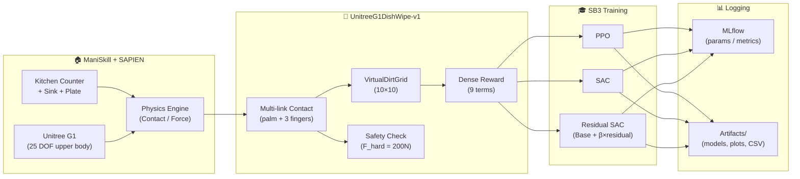
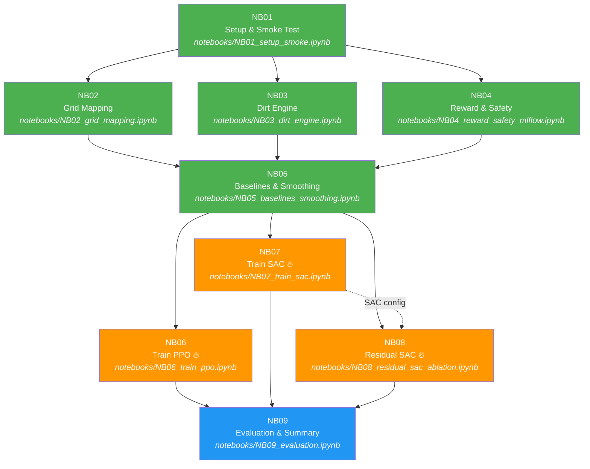

# 00 — ภาพรวมโปรเจกต์ (Project Overview)

> **Unitree G1 DishWipe** — สอนหุ่นยนต์ล้างจานด้วย Reinforcement Learning

---

## สารบัญ

- [เป้าหมายของโปรเจกต์](#เป้าหมายของโปรเจกต์)
- [สถาปัตยกรรมระบบ](#สถาปัตยกรรมระบบ)
- [สรุป Notebook Pipeline (NB01–NB09)](#สรุป-notebook-pipeline-nb01nb09)
- [Dependency Graph ระหว่าง Notebook](#dependency-graph-ระหว่าง-notebook)
- [หลักการ Fairness ในการเปรียบเทียบ](#หลักการ-fairness-ในการเปรียบเทียบ)
- [โครงสร้างโฟลเดอร์](#โครงสร้างโฟลเดอร์)
- [Hardware Requirements](#hardware-requirements)
- [ลิงก์เอกสารอื่น](#ลิงก์เอกสารอื่น)

---

## เป้าหมายของโปรเจกต์

โปรเจกต์นี้สร้าง **Simulation Environment** สำหรับหุ่นยนต์ Unitree G1 (ครึ่งบน, 25 DOF) ให้ทำภารกิจ **เช็ดจานในอ่างล้างจาน** ภายในครัวจำลอง โดยใช้แพลตฟอร์ม [ManiSkill 3](https://github.com/haosulab/ManiSkill) + [SAPIEN](https://sapien.ucsd.edu/) สำหรับ physics simulation

จากนั้นเปรียบเทียบ **3 วิธี Reinforcement Learning**:
1. **PPO** (Proximal Policy Optimization) — on-policy
2. **SAC** (Soft Actor-Critic) — off-policy
3. **Residual SAC** — SAC ที่ต่อยอดจาก heuristic controller

ทั้งหมดอยู่ภายใต้ budget เดียวกัน (fixed `TOTAL_ENV_STEPS`) และประเมินผลด้วยจำนวน episode เดียวกัน (`EVAL_EPISODES`) เพื่อความเป็นธรรม (fairness)

---

## สถาปัตยกรรมระบบ



---

## สรุป Notebook Pipeline (NB01–NB09)

| NB | ชื่อ | ทำอะไร | Input | Output / Artifacts | HW |
|----|------|--------|-------|--------------------|----|
| **NB01** | Setup & Smoke Test | ตรวจ dependencies, สร้าง env, ยืนยัน obs/act shape | `requirements.txt`, `src/envs/` | `artifacts/NB01/env_spec.json`, `active_joints.json`, `requirements.txt` | CPU |
| **NB02** | Grid Mapping | ทดสอบ world↔grid coordinate, contact detection, zig-zag path | NB01 (env ใช้ได้) | `artifacts/NB02/grid_trace.csv`, `grid_before.png`, `grid_after.png` | CPU |
| **NB03** | Dirt Engine | ทดสอบ brush radius, cleaning progress, plot ผล | NB01 (env ใช้ได้) | `artifacts/NB03/brush_effect_demo.png`, `cleaning_trace.csv` | CPU |
| **NB04** | Reward & Safety | สร้าง reward contract, ทดสอบ safety termination, MLflow helpers | NB01 (env ใช้ได้) | `artifacts/NB04/reward_contract.json` | CPU |
| **NB05** | Baselines & Smoothing | Random/Heuristic baselines, SmoothActionWrapper, BaseController | NB01–NB04 (env + reward เสร็จ) | `artifacts/NB05/baseline_leaderboard.csv` | CPU |
| **NB06** | Train PPO | เทรน PPO ด้วย SB3, บันทึก learning curve | NB05 (baseline เสร็จ) | `artifacts/NB06/ppo_model.zip`, `learning_curve.png` | **GPU** |
| **NB07** | Train SAC | เทรน SAC ด้วย SB3, replay buffer | NB05 (baseline เสร็จ) | `artifacts/NB07/sac_model.zip`, `learning_curve.png` | **GPU** |
| **NB08** | Residual SAC | เทรน Residual SAC (β ablation), BaseController + SAC | NB05 (BaseController), NB07 (SAC config) | `artifacts/NB08/residual_sac_beta*.zip`, `ablation_plot.png` | **GPU** |
| **NB09** | Evaluation & Summary | Eval ทุกวิธี, bootstrap CI, comparison plots, video | NB06/NB07/NB08 (models) | `artifacts/NB09/eval_table.csv`, `eval_comparison.png` | CPU/GPU |

---

## Dependency Graph ระหว่าง Notebook



> 🟢 = CPU ทำได้ &nbsp;&nbsp; 🟠 = ต้องใช้ GPU &nbsp;&nbsp; 🔵 = CPU/GPU

---

## หลักการ Fairness ในการเปรียบเทียบ

เพื่อให้การเปรียบเทียบ PPO vs SAC vs Residual SAC เป็นธรรม ต้องใช้:

| Parameter | ค่าที่กำหนด | ทำไม |
|-----------|------------|------|
| `TOTAL_ENV_STEPS` | 500,000 (GPU) / 20,000 (CPU) | Budget เท่ากัน — ถ้าให้ algorithm หนึ่งรันนานกว่าจะเปรียบเทียบไม่ได้ |
| `EVAL_EPISODES` | 100 episodes (deterministic) | จำนวน episode เท่ากัน เพื่อ statistical power |
| `SEEDS` | [42, 123, 456] (อย่างน้อย 3 seeds) | Variance ข้าม seed มีความสำคัญ |
| `control_mode` | `pd_joint_delta_pos` | ทุก algorithm ใช้ control mode เดียวกัน |
| `env_id` | `UnitreeG1DishWipe-v1` | Environment เดียวกันทุกการทดลอง |
| Eval mode | **deterministic** (PPO: deterministic, SAC: mean action) | ไม่ใช้ stochastic ตอน eval |

---

## โครงสร้างโฟลเดอร์

```
robotic-sim-dishwash/
├── README.md                 ← หน้าแรก (คุณอยู่ที่นี่ถ้าอ่าน README)
├── docs/                     ← เอกสารละเอียด (ภาษาไทย)
│   ├── 00_project_overview.md
│   ├── 01_repo_setup_local.md
│   ├── 02_runpod_setup.md
│   ├── 03_environment_and_task.md
│   ├── 04_notebook_guide.md
│   ├── 05_rl_methods_tutorial.md
│   ├── 06_experiment_tracking.md
│   └── 07_evaluation_and_reporting.md
├── notebooks/                ← Jupyter notebooks (NB01–NB09)
│   ├── NB01_setup_smoke.ipynb
│   ├── NB02_grid_mapping.ipynb
│   ├── ...
│   └── NB09_evaluation.ipynb
├── src/                      ← Source code
│   └── envs/
│       ├── __init__.py       ← Register env
│       ├── dishwipe_env.py   ← Custom ManiSkill env (~580 lines)
│       └── dirt_grid.py      ← VirtualDirtGrid (~145 lines)
├── scripts/
│   ├── runpod_setup.sh       ← Setup script สำหรับ RunPod
│   └── runpod_verify.py      ← ตรวจ dependencies
├── artifacts/                ← ผลลัพธ์จากแต่ละ NB (auto-generated)
│   ├── NB01/
│   ├── NB02/
│   └── ...
├── plan/                     ← Plan docs (internal)
├── ref-code/                 ← Reference code จากอาจารย์
├── .env.example              ← Template สำหรับ MLflow credentials
├── .gitignore
├── requirements.runpod.txt   ← Dependencies สำหรับ RunPod
└── .githubcopilot/
    ├── KNOLEDGE.md           ← Source of truth ของ env spec
    └── RULE.md               ← มาตรฐาน notebook
```

---

## Hardware Requirements

| Notebook | Required HW | CPU (cores) | RAM | GPU VRAM | Runtime โดยประมาณ |
|----------|-------------|-------------|-----|----------|-------------------|
| NB01 | CPU | 2+ | 4 GB | - | 1–2 นาที |
| NB02 | CPU | 2+ | 4 GB | - | 1–2 นาที |
| NB03 | CPU | 2+ | 4 GB | - | 1–2 นาที |
| NB04 | CPU | 2+ | 4 GB | - | 1–2 นาที |
| NB05 | CPU (GPU ถ้า sim ช้า) | 4+ | 8 GB | 8 GB (optional) | 5–15 นาที |
| NB06 | **GPU** | 8+ | 16 GB | 12–24 GB | 1–3 ชม. |
| NB07 | **GPU** | 8+ | 16 GB | 12–24 GB | 1–3 ชม. |
| NB08 | **GPU** | 8+ | 16 GB | 12–24 GB | 3–6 ชม. (3 runs) |
| NB09 | CPU/GPU | 4+ | 8 GB | 8 GB (optional) | 15–30 นาที |

> **RunPod แนะนำ**: RTX 4090 (24 GB VRAM) / 16 CPU cores / 64 GB RAM

---

## ลิงก์เอกสารอื่น

| เอกสาร | เนื้อหา |
|--------|---------|
| [01 — Setup บนเครื่อง Local](01_repo_setup_local.md) | วิธีสร้าง venv, ติดตั้ง dependencies, รัน notebook |
| [02 — Setup บน RunPod](02_runpod_setup.md) | วิธีสร้าง pod, SSH, VS Code Remote |
| [03 — Environment & Task](03_environment_and_task.md) | อธิบาย env, reward, contact, dirt grid |
| [04 — คู่มือ Notebook (NB01–NB09)](04_notebook_guide.md) | รายละเอียดทุก NB + input/output/pitfalls |
| [05 — RL Methods Tutorial](05_rl_methods_tutorial.md) | อธิบาย PPO, SAC, Residual Policy |
| [06 — Experiment Tracking](06_experiment_tracking.md) | MLflow + CSV logging |
| [07 — Evaluation & Reporting](07_evaluation_and_reporting.md) | NB09 eval pipeline, bootstrap CI |

---

*เอกสารนี้เป็นส่วนหนึ่งของ robotic-sim project — อัปเดตล่าสุด: มีนาคม 2026*
