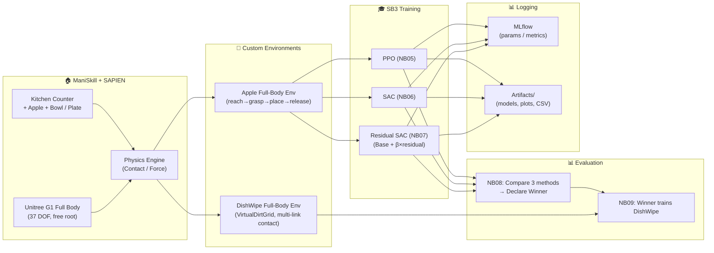
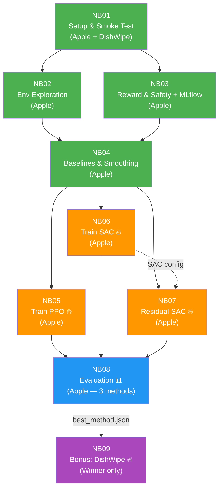

# 00 — ภาพรวมโปรเจกต์ (Project Overview)

> **Unitree G1 Full-Body RL** — สอนหุ่นยนต์หยิบแอปเปิลวางชาม + เช็ดจาน ด้วย Reinforcement Learning

---

## สารบัญ

- [เป้าหมายของโปรเจกต์](#เป้าหมายของโปรเจกต์)
- [สถาปัตยกรรมระบบ](#สถาปัตยกรรมระบบ)
- [สรุป Notebook Pipeline (NB01–NB09)](#สรุป-notebook-pipeline-nb01nb09)
- [Dependency Graph ระหว่าง Notebook](#dependency-graph-ระหว่าง-notebook)
- [หลักการ Fairness ในการเปรียบเทียบ](#หลักการ-fairness-ในการเปรียบเทียบ)
- [โครงสร้างโฟลเดอร์](#โครงสร้างโฟลเดอร์)
- [Hardware Requirements](#hardware-requirements)
- [ลิงก์เอกสารอื่น](#ลิงก์เอกสารอื่น)

---

## เป้าหมายของโปรเจกต์

โปรเจกต์นี้สร้าง **Simulation Environment** สำหรับหุ่นยนต์ Unitree G1 **แบบเต็มตัว (Full Body, 37 DOF)**
ที่ต้อง **ทรงตัว + ใช้มือทำงาน** พร้อมกัน โดยใช้แพลตฟอร์ม [ManiSkill 3](https://github.com/haosulab/ManiSkill)
+ [SAPIEN](https://sapien.ucsd.edu/) สำหรับ physics simulation

### 2 ภารกิจ (Tasks)

| Task | Env ID | สถานะ | คำอธิบาย |
|------|--------|-------|---------|
| **Apple (Main)** | `UnitreeG1PlaceAppleInBowlFullBody-v1` | NB01–NB08 | หยิบแอปเปิลแล้ววางลงในชาม — ต้องทรงตัว + เอื้อมมือ + หยิบ + วาง |
| **DishWipe (Bonus)** | `UnitreeG1DishWipeFullBody-v1` | NB09 เท่านั้น | เช็ดจานในอ่าง — ใช้ **เฉพาะ method ที่ชนะ** จาก Apple evaluation |

### เปรียบเทียบ 3 วิธี RL (บน Apple Task)

1. **PPO** (Proximal Policy Optimization) — on-policy, vectorized env
2. **SAC** (Soft Actor-Critic) — off-policy, replay buffer
3. **Residual SAC** — SAC ที่ต่อยอดจาก heuristic controller + β ablation

ทั้งหมดอยู่ภายใต้ budget เดียวกัน (fixed `TOTAL_ENV_STEPS = 2,000,000`) และประเมินผลด้วย
**200 episodes** + **Bootstrap 95% CI** + **Welch's t-test** + **Cohen's d** เพื่อความเป็นธรรม (fairness)

### เหตุผลที่ใช้ Full Body

อาจารย์กำหนดให้ใช้ **full body** เพื่อเพิ่มความท้าทาย:
- หุ่นยนต์ต้อง **ทรงตัว** (balance) ขณะทำงาน — ไม่มี fixed root
- Action space สูง (37 DOF) — 12 ขา + 11 ลำตัว/แขน + 14 นิ้ว
- ต้องป้องกันการล้ม (`is_fallen()` check)

---

## สถาปัตยกรรมระบบ



---

## สรุป Notebook Pipeline (NB01–NB09)

| NB | ชื่อ | Task | ทำอะไร | Output หลัก | HW |
|----|------|------|--------|-------------|-----|
| **NB01** | Setup & Smoke Test | Both | ตรวจ deps, สร้าง env ทั้ง 2 task, ยืนยัน obs/act | `env_spec.json`, `active_joints.json` | CPU |
| **NB02** | Env Exploration | Apple | สำรวจ obs/reward/joint mapping, reset-step loop, record trace | `env_exploration_trace.csv` | CPU |
| **NB03** | Reward & Safety + MLflow | Apple | ทดสอบ reward components, safety check, MLflow setup | `reward_contract.json` | CPU |
| **NB04** | Baselines & Smoothing | Apple | Random/Heuristic baselines, SmoothActionWrapper, BaseController | `baseline_leaderboard.csv` | CPU |
| **NB05** | Train PPO | Apple | SB3 PPO 2M steps, [512,512] ReLU, 64 envs, VecNormalize | `ppo_apple.zip`, `learning_curve.png` | **GPU** |
| **NB06** | Train SAC | Apple | SB3 SAC 2M steps, [512,512] ReLU, 10M buffer | `sac_apple.zip`, `learning_curve.png` | **GPU** |
| **NB07** | Residual SAC + Ablation | Apple | BaseController + β×SAC, β ∈ {0.1, 0.25, 0.5, 0.75, 1.0} | `residual_apple_beta*.zip`, `ablation_plot.png` | **GPU** |
| **NB08** | Evaluation | Apple | เปรียบเทียบ 3 methods, 200 eps × bootstrap + Welch's t + Cohen's d | `best_method.json`, `comparison_plot.png` | CPU/GPU |
| **NB09** | Bonus: DishWipe | DishWipe | เทรน **เฉพาะ method ที่ชนะ** บน DishWipe Full-Body, 2M steps | `{winner}_dishwipe.zip`, `cross_task_comparison.png` | **GPU** |

---

## Dependency Graph ระหว่าง Notebook



> 🟢 CPU | 🟠 GPU | 🔵 CPU/GPU | 🟣 Bonus (GPU)

---

## หลักการ Fairness ในการเปรียบเทียบ

เพื่อให้การเปรียบเทียบ PPO vs SAC vs Residual SAC เป็นธรรม:

| Parameter | ค่าที่กำหนด | ทำไม |
|-----------|------------|------|
| `TOTAL_ENV_STEPS` | 2,000,000 (GPU) / 20,000 (CPU) | Budget เท่ากัน |
| `EVAL_EPISODES` | 200 episodes (deterministic) | Statistical power เท่ากัน |
| `net_arch` | [512, 512] ReLU | Network size เท่ากัน (~790K params) |
| `VecNormalize` | norm_obs + norm_reward, clip=10 | Normalization เหมือนกัน |
| `LR schedule` | Linear decay 3e-4 → 1e-5 | LR schedule เหมือนกัน |
| `control_mode` | `pd_joint_delta_pos` | ทุก algorithm ใช้ control mode เดียวกัน |
| `env_id` | `UnitreeG1PlaceAppleInBowlFullBody-v1` | Environment เดียวกัน |
| Eval mode | **deterministic** | PPO: mode, SAC: mean action |
| Statistical tests | Welch's t-test + Cohen's d | เปรียบเทียบอย่างมีนัยสำคัญ |

---

## โครงสร้างโฟลเดอร์

```
robotic-sim/
├── README.md                           ← 📍 คุณอยู่ที่นี่
├── docs/                               ← เอกสารละเอียด (ภาษาไทย)
│   ├── 00_project_overview.md          ← ภาพรวม + pipeline
│   ├── 01_repo_setup_local.md          ← Setup บน Local
│   ├── 02_runpod_setup.md              ← Setup บน RunPod GPU
│   ├── 03_environment_and_task.md      ← Environment + Robot อธิบายละเอียด
│   ├── 04_notebook_guide.md            ← คู่มือ NB01-NB09
│   ├── 05_rl_methods_tutorial.md       ← PPO, SAC, Residual อธิบาย
│   ├── 06_experiment_tracking.md       ← MLflow + CSV logging
│   └── 07_evaluation_and_reporting.md  ← Evaluation pipeline
├── plan/                               ← แผนงานละเอียดแต่ละ NB
├── notebooks/                          ← Jupyter notebooks (NB01–NB09)
├── src/envs/                           ← Custom ManiSkill environments
│   ├── apple_fullbody_env.py           ← Apple Full-Body env (TO CREATE)
│   ├── dishwipe_fullbody_env.py        ← DishWipe Full-Body env (TO CREATE)
│   ├── dishwipe_env.py                 ← Original DishWipe upper body (reference)
│   ├── dirt_grid.py                    ← VirtualDirtGrid (10×10)
│   └── __init__.py
├── scripts/                            ← Setup scripts
├── artifacts/                          ← ผลลัพธ์จากแต่ละ NB (auto-generated)
│   ├── NB01/ ... NB09/
├── ref-code/                           ← Reference code (original lab)
├── .env.example                        ← Template สำหรับ MLflow credentials
└── requirements.runpod.txt             ← Dependencies
```

---

## Hardware Requirements

| Component | NB01–NB04 (CPU) | NB05–NB07 (Training) | NB08 (Eval) | NB09 (Bonus) |
|-----------|-----------------|----------------------|-------------|--------------|
| CPU | 2+ cores | 16+ cores | 8+ cores | 16+ cores |
| RAM | 4 GB | 40 GB | 16+ GB | 40 GB |
| GPU | - | **RTX 5090 (32 GB VRAM)** | Optional | **RTX 5090** |
| Storage | 5 GB | 100 GB | 20 GB | 20 GB |

> **RunPod แนะนำ**: **RTX 5090** / 16 CPU cores / 40 GB RAM / 100 GB disk
> **GPU Budget ประมาณ**: NB05 (2-4h) + NB06 (2-4h) + NB07 (10-20h, 5 betas) + NB09 (2-4h) ≈ **16-32 ชั่วโมง**

---

## ลิงก์เอกสารอื่น

| # | เอกสาร | เนื้อหา |
|---|--------|---------|
| 01 | [Setup Local](01_repo_setup_local.md) | venv, pip install, VS Code |
| 02 | [Setup RunPod](02_runpod_setup.md) | SSH, Pod, GPU check |
| 03 | [Environment & Task](03_environment_and_task.md) | Apple + DishWipe envs, Robot 37 DOF |
| 04 | [คู่มือ Notebook](04_notebook_guide.md) | NB01-NB09 ทุกรายละเอียด |
| 05 | [RL Methods Tutorial](05_rl_methods_tutorial.md) | PPO, SAC, Residual Policy |
| 06 | [Experiment Tracking](06_experiment_tracking.md) | MLflow setup |
| 07 | [Evaluation & Reporting](07_evaluation_and_reporting.md) | Bootstrap CI, comparison |

---

*อัปเดตล่าสุด: มีนาคม 2026 | Full-Body G1 (37 DOF) — Apple (Main) + DishWipe (Bonus)*
