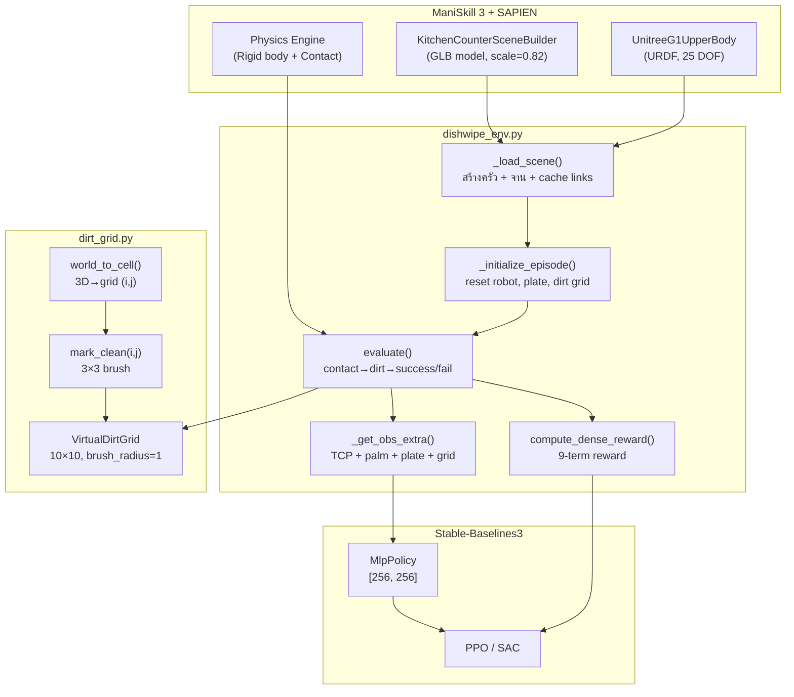
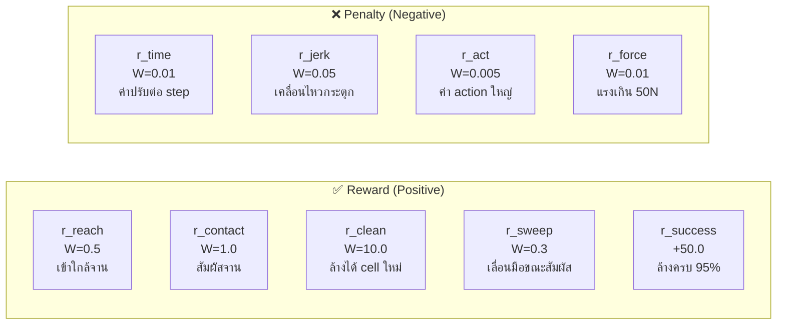

# 03 — Environment & Task อธิบายละเอียด

> เอกสารนี้อธิบายสถาปัตยกรรม environment ทั้งหมด: scene, หุ่นยนต์, reward, contact, dirt grid

---

## สารบัญ

- [ภาพรวม Environment](#ภาพรวม-environment)
- [Architecture Diagram](#architecture-diagram)
- [Scene: ครัว + อ่างล้างจาน + จาน](#scene-ครัว--อ่างล้างจาน--จาน)
- [Robot: Unitree G1 Upper Body](#robot-unitree-g1-upper-body)
- [dishwipe_env.py — Custom Environment](#dishwipe_envpy--custom-environment)
- [dirt_grid.py — VirtualDirtGrid](#dirt_gridpy--virtualdirtgrid)
- [Contact Detection (Multi-link)](#contact-detection-multi-link)
- [Reward Function (9 terms)](#reward-function-9-terms)
- [Observation & Action Space](#observation--action-space)
- [Safety & Termination](#safety--termination)
- [การ Register Env ใน \_\_init\_\_.py](#การ-register-env-ใน-__init__py)
- [Exported Constants](#exported-constants)
- [ข้อควรระวัง](#ข้อควรระวัง)
- [การแก้ Config](#การแก้-config)

---

## ภาพรวม Environment

โปรเจกต์นี้สร้าง **custom ManiSkill environment** ชื่อ `UnitreeG1DishWipe-v1` ที่:

1. ใช้ scene **ครัวจำลอง** (Kitchen Counter) จาก ManiSkill พร้อมอ่างล้างจาน
2. วาง **จาน** (plate) ไว้ในอ่างล้างจาน
3. หุ่นยนต์ **Unitree G1** (ครึ่งบน, 25 DOF) ต้องใช้มือซ้ายเช็ดจาน
4. จาน **แบ่งเป็น grid 10×10** — ทุก cell เริ่มเป็น "สกปรก" (dirty)
5. เมื่อมือสัมผัสจาน → cell ที่อยู่ใต้จุดสัมผัสจะเปลี่ยนเป็น "สะอาด" (clean)
6. เป้าหมาย: **ทำความสะอาด ≥ 95%** ของ grid

---

## Architecture Diagram



---

## Scene: ครัว + อ่างล้างจาน + จาน

### Kitchen Counter
- ใช้ `KitchenCounterSceneBuilder` จาก ManiSkill
- เป็น GLB 3D model ขนาด scale = **0.82** (เท่ากับ PlaceAppleInBowl env)
- มีพื้นครัว, เคาน์เตอร์, อ่างล้างจาน (sink)

### Sink (อ่างล้างจาน)
ตำแหน่งอ่างล้างจานที่ scale 0.82:
```
x ∈ [-0.01, 0.32]
y ∈ [0.04, 0.49]
z ∈ [0.56, 0.79]
```

### Plate (จาน)
- ประเภท: **Kinematic actor** (ไม่เคลื่อนที่ตาม physics)
- ขนาด: 20cm × 20cm × 6mm (half-size: 0.10, 0.10, 0.003)
- ตำแหน่ง: **ในอ่างล้างจาน** ที่ `(0.10, 0.20, 0.58)`
- มี randomize ±2.5 cm ในแกน X, Y ทุกครั้งที่ reset

> **ทำไมจานอยู่ในอ่าง?** — เพื่อให้สมจริง (ล้างจานในอ่าง) และมือหุ่นยนต์เอื้อมถึงพอดี

---

## Robot: Unitree G1 Upper Body

| คุณสมบัติ | ค่า |
|----------|-----|
| Robot ID | `unitree_g1_simplified_upper_body` |
| Class | `UnitreeG1UpperBody` |
| DOF (degrees of freedom) | **25** |
| ตำแหน่งเริ่มต้น | `(-0.3, 0.0, 0.755)` |
| Root link | **Fixed** (ไม่เคลื่อนที่ — ไม่ต้อง balance) |
| ขาข้อต่อ | ไม่ active (legs locked) |
| Active joints | 1 torso + 10 upper body + 14 finger |
| TCP | `left_tcp`, `right_tcp` (มีทั้งสองข้าง) |
| Palm link | `left_palm_link`, `right_palm_link` |

### Joint ที่ active (25 อัน)
```
torso_joint
left/right_shoulder_pitch_joint
left/right_shoulder_roll_joint
left/right_shoulder_yaw_joint
left/right_elbow_pitch_joint
left/right_elbow_roll_joint
left/right_zero_joint, one_joint, two_joint  (fingers)
left/right_three_joint, four_joint, five_joint, six_joint (fingers)
```

---

## dishwipe_env.py — Custom Environment

ไฟล์หลักอยู่ที่ `src/envs/dishwipe_env.py` (~580 บรรทัด)

### โครงสร้าง Class

```
UnitreeG1DishWipeEnvBase (BaseEnv)     ← Base class, มี logic ทั้งหมด
    │
    └── UnitreeG1DishWipeEnv           ← Registered env (@register_env)
            - robot_uids = "unitree_g1_simplified_upper_body"
            - max_episode_steps = 1000
```

### Methods สำคัญ

| Method | ทำอะไร |
|--------|--------|
| `_load_scene()` | สร้าง kitchen scene + plate + cache contact links + สร้าง dirt grid |
| `_initialize_episode()` | Reset robot pose, plate position (±2.5cm random), dirt grid |
| `_get_contact_info()` | ตรวจ contact 4 links กับ plate → รวม force + คำนวณ centroid |
| `_update_dirt_grids()` | แปลง centroid → grid cell → mark clean |
| `evaluate()` | เรียก contact + dirt update → คืน success/fail/metrics |
| `_get_obs_extra()` | สร้าง observation เพิ่มเติม (palm, plate, grid, force) |
| `compute_dense_reward()` | คำนวณ reward 9 terms |

---

## dirt_grid.py — VirtualDirtGrid

ไฟล์อยู่ที่ `src/envs/dirt_grid.py` (~145 บรรทัด)

### หน้าที่
- เก็บสถานะ dirty/clean ของ grid 10×10 (numpy array)
- แปลง **พิกัดโลก** (world coordinate) เป็น **cell index** (i, j)
- ทำ **brush effect** — เมื่อสัมผัส cell (i,j) จะล้าง cell รอบๆ ด้วย (เช่น 3×3)

### Methods สำคัญ

| Method | ทำอะไร | Return |
|--------|--------|--------|
| `reset()` | ตั้ง grid ทั้งหมดเป็น 0 (dirty) | grid copy |
| `mark_clean(i, j)` | ล้าง cell (i,j) + รอบๆ ตาม brush_radius | จำนวน cell ที่ใหม่ clean (int) |
| `get_cleaned_ratio()` | สัดส่วน cell ที่สะอาดแล้ว | float (0.0 – 1.0) |
| `get_grid_flat()` | grid เป็น 1D array | numpy array (100,) |
| `world_to_uv(xyz, center, half)` | แปลง world → UV (0-1) | (u, v) |
| `uv_to_cell(u, v)` | แปลง UV → cell index | (i, j) |
| `world_to_cell(xyz, center, half)` | world → cell (รวมทั้ง 2 ขั้น) | (i, j) |

### Brush Radius
```
brush_radius = 0 → ล้างเฉพาะ cell เดียว (1×1)
brush_radius = 1 → ล้าง 3×3 (default) = 9 cells ต่อครั้ง
brush_radius = 2 → ล้าง 5×5 = 25 cells ต่อครั้ง
```

### การแปลง Coordinate

```
World (x, y, z) ← ตำแหน่งจริงในฉากจำลอง
      ↓
UV (u, v)       ← ตำแหน่งสัมพัทธ์บนจาน (0-1)
      ↓
Cell (i, j)     ← index ใน grid 10×10
```

สูตร:
- `u = (x - (cx - hx)) / (2 * hx)` — cx = plate center x, hx = plate half-size x
- `v = (y - (cy - hy)) / (2 * hy)`
- `i = floor(v * H)`, `j = floor(u * W)`

---

## Contact Detection (Multi-link)

### ทำไมต้อง Multi-link?

เวอร์ชันเก่าใช้ TCP (Tool Center Point) เดียว แต่:
- TCP อยู่ห่างจาก palm ~7cm → ตำแหน่งที่ RL คิดว่าสัมผัสไม่ตรงกับจริง
- นิ้วมือสัมผัสจานได้แต่ TCP ไม่สัมผัส → ไม่นับ contact

### วิธีที่ใช้ (v2)

4 links ที่ใช้ตรวจ contact:

| Link | ตำแหน่ง |
|------|---------|
| `left_palm_link` | ฝ่ามือซ้าย |
| `left_two_link` | นิ้ว L1 |
| `left_four_link` | นิ้ว R1 |
| `left_six_link` | นิ้ว R2 |

### ขั้นตอน
1. สำหรับแต่ละ link: เรียก `scene.get_pairwise_contact_forces(link, plate)`
2. คำนวณ force magnitude: `||force_vector||` (L2 norm)
3. รวม force ทุก link: `total_force = sum(magnitudes)`
4. คำนวณ **force-weighted centroid**:
   ```
   centroid = Σ(force_i × position_i) / Σ(force_i)
   ```
5. ถ้า `total_force > 0.5 N` → นับว่า "contact"
6. ใช้ centroid (ไม่ใช่ TCP) แปลงเป็น grid cell

> **ข้อสำคัญ**: Force ที่วัดคือ **magnitude** (L2 norm) ไม่ใช่ Fz (แกน z)  
> เนื่องจากจานวางนอน (horizontal) magnitude ≈ Fz ในทางปฏิบัติ แต่ยังจับ lateral shear ด้วย

---

## Reward Function (9 terms)



### รายละเอียดแต่ละ term

| # | Term | Weight | สูตร | อธิบาย |
|--:|------|--------|------|--------|
| 1 | **r_reach** | 0.5 | `w × (1 - tanh(5 × dist(palm, plate)))` | ให้รางวัลเมื่อ palm เข้าใกล้จาน (0 ถึง 0.5) |
| 2 | **r_contact** | 1.0 | `w × is_contacting` | +1.0 ทุก step ที่สัมผัสจาน |
| 3 | **r_clean** | 10.0 | `w × delta_clean` | +10 ต่อ cell ใหม่ที่ล้าง (max +90 ถ้าล้าง 9 cells/step) |
| 4 | **r_sweep** | 0.3 | `w × lateral_speed × is_contact` | ให้รางวัลเมื่อเลื่อนมือด้านข้าง (XY) ขณะสัมผัส — สนับสนุน wiping motion |
| 5 | **r_time** | -0.01 | `-w per step` | ค่าปรับเวลา — กระตุ้นให้รีบทำ |
| 6 | **r_jerk** | -0.05 | `-w × ‖aₜ − aₜ₋₁‖²` | ลงโทษการเปลี่ยน action กะทันหัน — ให้การเคลื่อนไหวนุ่มนวล |
| 7 | **r_act** | -0.005 | `-w × ‖aₜ‖²` | ลงโทษค่า action ใหญ่ — ป้องกันใช้แรงเยอะเกิน |
| 8 | **r_force** | -0.01 | `-w × max(0, F - 50)` | ลงโทษเมื่อแรงเกิน soft limit (50N) |
| 9 | **r_success** | +50.0 | one-shot เมื่อ cleaned ≥ 95% | รางวัลใหญ่ตอนสำเร็จ (ให้แค่ครั้งเดียว) |

### Staged Design
Reward ออกแบบเป็น "ขั้นบันได":
1. **ขั้น 0**: เอามือเข้าใกล้จาน (r_reach)
2. **ขั้น 1**: สัมผัสจาน (r_contact)
3. **ขั้น 2**: ล้าง cell (r_clean + r_sweep)
4. **ขั้น 3**: ล้างครบ (r_success)

---

## Observation & Action Space

### Observation (state mode) — 168 dimensions

| Component | Dim | คำอธิบาย |
|-----------|-----|---------|
| `qpos` | 25 | ตำแหน่งข้อต่อ |
| `qvel` | 25 | ความเร็วข้อต่อ |
| ManiSkill base extras | ~4 | elapsed_steps etc. |
| `tcp_pose` | 7 | Left TCP pose (position + quaternion) |
| `palm_pos` | 3 | ตำแหน่ง palm ซ้าย |
| `plate_pos` | 3 | ตำแหน่งจาน |
| `palm_to_plate` | 3 | vector จาก palm ไปจาน |
| `contact_force` | 1 | แรง contact รวม (magnitude) |
| `cleaned_ratio` | 1 | สัดส่วนที่ล้างแล้ว (0-1) |
| `dirt_grid` | 100 | สถานะ grid 10×10 (0=dirty, 1=clean) |
| **รวม** | **~168** | |

> **ทำไม obs เป็น flat tensor?**  
> ManiSkill ใน state mode จะ flatten dict obs อัตโนมัติ ดังนั้น SB3 ใช้ `MlpPolicy` ได้เลย (ไม่ต้องใช้ `MultiInputPolicy`)

### Action Space — 25 dimensions

- ประเภท: `Box(-1.0, 1.0, shape=(25,))`
- Control mode: `pd_joint_delta_pos`
- แต่ละ action dim ควบคุม joint 1 อัน (delta position)

---

## Safety & Termination

| เงื่อนไข | ค่า | ผลลัพธ์ |
|----------|-----|---------|
| **Success** | cleaned_ratio ≥ 0.95 | `info['success'] = True`, episode จบ |
| **Force limit** | contact_force > 200 N | `info['fail'] = True`, episode จบ |
| **Timeout** | steps ≥ 1000 | episode truncated |
| **Soft penalty** | contact_force > 50 N | reward penalty (ไม่จบ episode) |

> ⚠️ **ห้ามปิด safety termination เพื่อเพิ่ม reward** — ผลที่ได้จะไม่ realistic

---

## การ Register Env ใน `__init__.py`

ไฟล์ `src/envs/__init__.py`:
```python
from src.envs.dishwipe_env import UnitreeG1DishWipeEnv  # noqa: F401
```

เมื่อ import module นี้ `@register_env("UnitreeG1DishWipe-v1", max_episode_steps=1000)` จะทำงานอัตโนมัติ

การใช้งานใน notebook:
```python
# ต้อง import ก่อน gym.make() เสมอ!
from src.envs.dishwipe_env import UnitreeG1DishWipeEnv

import gymnasium as gym
env = gym.make("UnitreeG1DishWipe-v1", obs_mode="state", control_mode="pd_joint_delta_pos")
```

> **ข้อผิดพลาดที่พบบ่อย**: ถ้าลืม import `UnitreeG1DishWipeEnv` ก่อน `gym.make()` จะได้ `gymnasium.error.NameNotFound`

---

## Exported Constants

Constants เหล่านี้ import ได้จาก `src.envs.dishwipe_env`:

```python
from src.envs.dishwipe_env import (
    PLATE_POS_IN_SINK,       # (0.10, 0.20, 0.58) — ตำแหน่งจาน
    PLATE_POS_ON_COUNTER,    # alias → PLATE_POS_IN_SINK (deprecated)
    PLATE_HALF_SIZE,         # (0.10, 0.10, 0.003)
    GRID_H, GRID_W,          # 10, 10
    BRUSH_RADIUS,            # 1
    W_CLEAN, W_REACH, W_CONTACT, W_SWEEP,  # reward weights
    W_TIME, W_JERK, W_ACT, W_FORCE,
    SUCCESS_BONUS,           # 50.0
    FZ_SOFT, FZ_HARD,        # 50 N, 200 N
    SUCCESS_CLEAN_RATIO,     # 0.95
    CONTACT_THRESHOLD,       # 0.5 N
    KITCHEN_SCENE_SCALE,     # 0.82
)
```

---

## ข้อควรระวัง

### 1. TCP vs Palm
- **TCP** (`agent.left_tcp`) = Tool Center Point — อยู่ปลายมือ, offset ~7cm จาก palm
- **Palm** (`left_palm_link`) = ฝ่ามือ — ใช้คำนวณ reaching reward
- **ไม่ใช้ TCP ใน reward** เพราะ contact จริงเกิดที่ palm/fingers

### 2. Contact Force = Magnitude (ไม่ใช่ Fz)
- `contact_force` คือ **L2 norm** ของ force vector (ทุกแกน)
- ถ้าจานวางราบ: magnitude ≈ Fz (แนวตั้ง) — ตัดสิน safety ได้
- ถ้าจานเอียง: magnitude อาจ > pure Fz — conservative (ปลอดภัยกว่า)

### 3. Render อาจ fail
- บนเครื่อง CPU-only Vulkan อาจไม่ทำงาน
- code ทุกที่มี `try/except` สำหรับ render
- training ไม่ต้อง render (ใช้ `obs_mode="state"`)

### 4. `left_tcp` Guard
- code มี `assert hasattr(self.agent, "left_tcp")` ป้องกัน
- ถ้า robot URDF ไม่มี TCP จะเห็น error ชัดเจนว่า attribute ไหนหาย

---

## การแก้ Config

ถ้าต้องการปรับ env สำหรับ experiment ต่างๆ:

| ต้องการเปลี่ยน | แก้ตรงไหน | ผลกระทบ |
|---------------|----------|---------|
| ขนาดจาน | `PLATE_HALF_SIZE` ใน `dishwipe_env.py` | grid mapping เปลี่ยน |
| ตำแหน่งจาน | `PLATE_POS_IN_SINK` | หุ่นยนต์อาจเอื้อมไม่ถึง |
| ขนาด grid | `GRID_H`, `GRID_W` | obs dim เปลี่ยน (ต้องเทรนใหม่!) |
| Brush radius | `BRUSH_RADIUS` | ล้างเร็ว/ช้าขึ้น |
| Reward weights | `W_CLEAN`, `W_REACH` ฯลฯ | พฤติกรรม agent เปลี่ยน |
| Safety limits | `FZ_SOFT`, `FZ_HARD` | ระดับ force ที่ปลอดภัย |
| Control mode | `control_mode` ใน `gym.make()` | action space interpretation |
| Max steps | `@register_env(..., max_episode_steps=...)` | episode length |

> ⚠️ ถ้าเปลี่ยน obs dim (เช่น grid size) ต้อง **เทรน model ใหม่ทั้งหมด**

---

*ก่อนหน้า → [02 — RunPod Setup](02_runpod_setup.md) | ต่อไป → [04 — คู่มือ Notebook](04_notebook_guide.md)*
