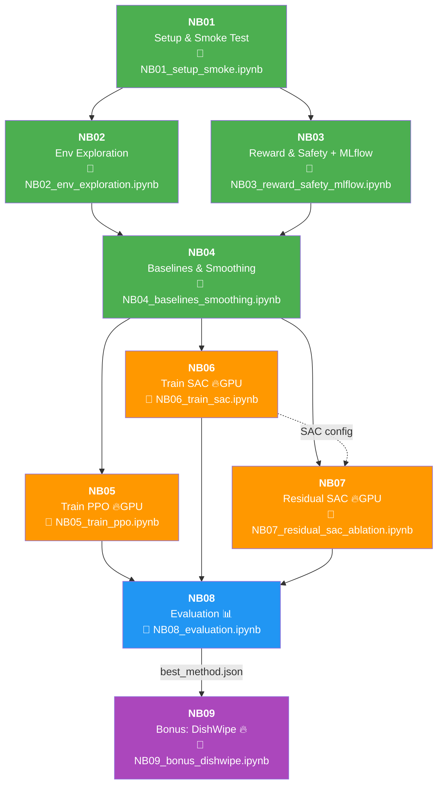

# 04 — คู่มือ Notebook (NB01–NB09) แบบละเอียด

> เอกสารนี้อธิบายทุก notebook: ทำอะไร, input/output, config, ปัญหาที่อาจเจอ

---

## สารบัญ

- [Dependency Graph](#dependency-graph)
- [NB01 — Setup & Smoke Test](#nb01--setup--smoke-test)
- [NB02 — Env Exploration (Apple)](#nb02--env-exploration-apple)
- [NB03 — Reward & Safety + MLflow](#nb03--reward--safety--mlflow)
- [NB04 — Baselines & Smoothing](#nb04--baselines--smoothing)
- [NB05 — Train PPO (Apple)](#nb05--train-ppo-apple)
- [NB06 — Train SAC (Apple)](#nb06--train-sac-apple)
- [NB07 — Residual SAC + Ablation (Apple)](#nb07--residual-sac--ablation-apple)
- [NB08 — Evaluation (Apple — 3 Methods)](#nb08--evaluation-apple--3-methods)
- [NB09 — Bonus: DishWipe (Winner Only)](#nb09--bonus-dishwipe-winner-only)
- [สรุปตาราง I/O ทุก NB](#สรุปตาราง-io-ทุก-nb)

---

## Dependency Graph



> 🟢 CPU | 🟠 GPU | 🔵 CPU/GPU | 🟣 Bonus GPU

---

## NB01 — Setup & Smoke Test

📁 `notebooks/NB01_setup_smoke.ipynb` | HW: CPU

### Objective
ตรวจสอบว่าทุกอย่างพร้อม: dependencies, env ทั้ง 2 task สร้างได้, obs/act shape ถูกต้อง

### Required Input
| สิ่งที่ต้องมี | ที่มา |
|-------------|------|
| Virtual environment (`.env/`) | Setup doc 01 |
| `src/envs/apple_fullbody_env.py` | source code |
| `src/envs/dishwipe_fullbody_env.py` | source code |

### Produced Artifacts
| ไฟล์ | Path | คำอธิบาย |
|------|------|---------|
| `env_spec.json` | `artifacts/NB01/` | obs/act shape ทั้ง 2 envs |
| `active_joints.json` | `artifacts/NB01/` | 37 active joints (full body) |
| `smoke_summary.json` | `artifacts/NB01/` | ผลทดสอบ 50 steps × 2 envs |
| `requirements.txt` | `artifacts/NB01/` | pip freeze |

### Expected Values
| Check | Apple Env | DishWipe Env |
|-------|-----------|-------------|
| obs dim | ~110+ | ~200+ |
| act dim | 37 | 37 |
| robot DOF | 37 | 37 |
| max_episode_steps | 100 | 1000 |

### Runtime: 1-2 นาที (CPU)

---

## NB02 — Env Exploration (Apple)

📁 `notebooks/NB02_env_exploration.ipynb` | HW: CPU

### Objective
สำรวจ Apple env อย่างละเอียด: obs breakdown, reward components, joint mapping, reset-step behavior

### Required Input
| สิ่งที่ต้องมี | ที่มา |
|-------------|------|
| NB01 completed | `artifacts/NB01/env_spec.json` |

### Produced Artifacts
| ไฟล์ | Path | คำอธิบาย |
|------|------|---------|
| `env_exploration_trace.csv` | `artifacts/NB02/` | Per-step obs/reward trace |
| `nb02_config.json` | `artifacts/NB02/` | Config |

### Key Activities
1. สร้าง env → inspect obs/act spaces
2. Reset → ดูตำแหน่ง Apple, Bowl, Robot
3. Step ด้วย random/zero actions → observe reward pattern
4. Map obs indices → meaning (qpos, tcp, apple, bowl)
5. Identify joint groups (legs, arms, hands)

### Runtime: 2-5 นาที (CPU)

---

## NB03 — Reward & Safety + MLflow

📁 `notebooks/NB03_reward_safety_mlflow.ipynb` | HW: CPU

### Objective
ทดสอบ reward structure ของ Apple env, ตรวจ safety (fall detection), setup MLflow

### Required Input
| สิ่งที่ต้องมี | ที่มา |
|-------------|------|
| NB01 completed | `artifacts/NB01/env_spec.json` |
| `.env.local` | MLflow credentials |

### Produced Artifacts
| ไฟล์ | Path | คำอธิบาย |
|------|------|---------|
| `reward_contract.json` | `artifacts/NB03/` | Reward range, components, thresholds |
| `nb03_config.json` | `artifacts/NB03/` | Config |

### Key Activities
1. Run episodes → record per-step reward breakdown
2. Test reward stages: reach → grasp → place → release
3. Test fall detection: force robot to bad pose → verify termination
4. Test standing bonus: verify bonus when upright
5. Setup MLflow connection + test logging

### Runtime: 2-5 นาที (CPU)

---

## NB04 — Baselines & Smoothing

📁 `notebooks/NB04_baselines_smoothing.ipynb` | HW: CPU

### Objective
สร้าง baseline policies (Random, Zero, Heuristic), EMA smoothing, BaseController สำหรับ Residual SAC

### Required Input
| สิ่งที่ต้องมี | ที่มา |
|-------------|------|
| NB01 completed | `artifacts/NB01/` |
| NB03 completed | `artifacts/NB03/reward_contract.json` |

### Produced Artifacts
| ไฟล์ | Path | คำอธิบาย |
|------|------|---------|
| `baseline_leaderboard.csv` | `artifacts/NB04/` | Performance per baseline |
| `nb04_config.json` | `artifacts/NB04/` | Config |

### Key Activities
1. Random policy → 20 episodes → record mean reward
2. Zero policy → 20 episodes → record
3. Heuristic policy (reach toward apple) → 20 episodes
4. SmoothActionWrapper (EMA) → test smoothing effect
5. BaseController (heuristic + EMA) → define for NB07

### Expected Outcome
| Policy | mean_reward | success_rate |
|--------|------------|-------------|
| Random | < 0 | 0% |
| Zero | ~0 | 0% |
| Heuristic | > Random | ~0-5% |
| Heuristic (smoothed) | > Heuristic | ~0-5% |

### Runtime: 5-10 นาที (CPU)

---

## NB05 — Train PPO (Apple)

📁 `notebooks/NB05_train_ppo.ipynb` | HW: **GPU**

### Objective
Train PPO on Apple Full-Body, 2M steps with RTX 5090 optimization

### Required Input
| สิ่งที่ต้องมี | ที่มา |
|-------------|------|
| NB04 completed | `artifacts/NB04/` |
| GPU | RunPod RTX 5090 / Local |

### Produced Artifacts
| ไฟล์ | Path |
|------|------|
| `ppo_apple.zip` | `artifacts/NB05/` |
| `learning_curve.png` | `artifacts/NB05/` |
| `eval_results.json` | `artifacts/NB05/` |
| `nb05_config.json` | `artifacts/NB05/` |
| `checkpoint_*.zip` | `artifacts/NB05/` (every 200K steps) |

### Hyperparameters
| Param | Value |
|-------|-------|
| total_steps | 2,000,000 (2M) |
| n_envs | 64 (GPU-vectorized) |
| lr | 3e-4 → 1e-5 (linear decay) |
| n_steps | 2048 |
| batch_size | 2048 |
| net_arch | [512, 512] ReLU |
| clip_range | 0.2 |
| ent_coef | 0.01 |
| VecNormalize | norm_obs + norm_reward |
| Checkpointing | every 200K steps |

### Runtime: 2–4 ชม. (RTX 5090 GPU)

---

## NB06 — Train SAC (Apple)

📁 `notebooks/NB06_train_sac.ipynb` | HW: **GPU**

### Objective
Train SAC on Apple Full-Body, 2M steps, automatic entropy tuning, 10M replay buffer

### Required Input
| สิ่งที่ต้องมี | ที่มา |
|-------------|------|
| NB04 completed | `artifacts/NB04/` |
| GPU | RunPod RTX 5090 / Local |

### Produced Artifacts
| ไฟล์ | Path |
|------|------|
| `sac_apple.zip` | `artifacts/NB06/` |
| `learning_curve.png` | `artifacts/NB06/` |
| `eval_results.json` | `artifacts/NB06/` |
| `nb06_config.json` | `artifacts/NB06/` |
| `checkpoint_*.zip` | `artifacts/NB06/` (every 200K steps) |

### Hyperparameters
| Param | Value |
|-------|-------|
| total_steps | 2,000,000 (2M, SAME as NB05) |
| n_envs | 1 (off-policy) |
| lr | 3e-4 → 1e-5 (linear decay) |
| buffer_size | 10,000,000 (10M) |
| batch_size | 1024 |
| net_arch | [512, 512] ReLU (SAME as NB05) |
| ent_coef | "auto" |
| tau | 0.005 |
| VecNormalize | norm_obs + norm_reward |
| Checkpointing | every 200K steps |

### Runtime: 2–4 ชม. (RTX 5090 GPU)

---

## NB07 — Residual SAC + Ablation (Apple)

📁 `notebooks/NB07_residual_sac_ablation.ipynb` | HW: **GPU**

### Objective
Train Residual SAC with BaseController + β ablation on Apple Full-Body

### Required Input
| สิ่งที่ต้องมี | ที่มา |
|-------------|------|
| NB04 completed | BaseController defined |
| NB06 completed | `artifacts/NB06/nb06_config.json` (SAC hyperparams) |
| GPU | RunPod RTX 5090 / Local |

### Produced Artifacts
| ไฟล์ | Path |
|------|------|
| `residual_apple_beta0.1.zip` | `artifacts/NB07/` |
| `residual_apple_beta0.25.zip` | `artifacts/NB07/` |
| `residual_apple_beta0.5.zip` | `artifacts/NB07/` |
| `residual_apple_beta0.75.zip` | `artifacts/NB07/` |
| `residual_apple_beta1.0.zip` | `artifacts/NB07/` |
| `ablation_table.csv` | `artifacts/NB07/` |
| `ablation_plot.png` | `artifacts/NB07/` |
| `best_beta.json` | `artifacts/NB07/` |

### Key Concept

```
a_final = clip(a_base + β × a_residual, -1, 1)
```

| β | ลักษณะ |
|---|--------|
| 0.10 | Very conservative — เกือบทั้งหมดตาม heuristic |
| 0.25 | Conservative — ส่วนใหญ่ตาม heuristic |
| 0.50 | Balanced — ระหว่าง heuristic กับ SAC |
| 0.75 | Moderate — SAC มีอิทธิพลมากขึ้น |
| 1.00 | Aggressive — override heuristic ได้เต็มที่ |

### Runtime: 10–20 ชม. (5 runs × 2M steps, RTX 5090)

---

## NB08 — Evaluation (Apple — 3 Methods)

📁 `notebooks/NB08_evaluation.ipynb` | HW: CPU/GPU

### Objective
เปรียบเทียบ PPO / SAC / Residual-SAC บน Apple, 200 episodes, bootstrap 95% CI + Welch's t-test + Cohen's d, ประกาศผู้ชนะ

### Required Input
| สิ่งที่ต้องมี | ที่มา |
|-------------|------|
| PPO model | `artifacts/NB05/ppo_apple.zip` |
| SAC model | `artifacts/NB06/sac_apple.zip` |
| Residual-SAC | `artifacts/NB07/best_beta.json` → model |
| Baselines | `artifacts/NB04/baseline_leaderboard.csv` |

### Produced Artifacts
| ไฟล์ | Path | คำอธิบาย |
|------|------|---------|
| `eval_200ep.csv` | `artifacts/NB08/` | Per-episode results, all methods |
| `comparison_table.csv` | `artifacts/NB08/` | Summary with 95% CI |
| `comparison_plot.png` | `artifacts/NB08/` | Bar chart with CI |
| `success_rate_plot.png` | `artifacts/NB08/` | Success rate comparison |
| `reward_distribution.png` | `artifacts/NB08/` | Violin/box plot |
| **`best_method.json`** | `artifacts/NB08/` | **Winner declaration → ใช้ใน NB09** |

### Evaluation Details
- 200 episodes per method, `deterministic=True`
- Seeds: ep=0..199 (reproducible)
- Bootstrap: 50,000 resamples → 95% percentile CI
- Welch's t-test + Cohen's d for all method pairs
- Winner: highest mean_reward (tie-break: success_rate)

### Runtime: 30-60 นาที

---

## NB09 — Bonus: DishWipe (Winner Only)

📁 `notebooks/NB09_bonus_dishwipe.ipynb` | HW: **GPU**

### Objective
Self-contained bonus: train **only the winning method** from NB08 on DishWipe Full-Body

### Required Input
| สิ่งที่ต้องมี | ที่มา |
|-------------|------|
| **`best_method.json`** | `artifacts/NB08/` — ชื่อ method ที่ชนะ |
| `comparison_table.csv` | `artifacts/NB08/` — Apple results for comparison |
| `src/envs/dishwipe_fullbody_env.py` | DishWipe Full-Body env |
| GPU | RunPod / Local |

### Produced Artifacts
| ไฟล์ | Path |
|------|------|
| `{winner}_dishwipe.zip` | `artifacts/NB09/` |
| `learning_curve.png` | `artifacts/NB09/` |
| `eval_200ep.csv` | `artifacts/NB09/` |
| `dishwipe_summary.json` | `artifacts/NB09/` |
| `cross_task_comparison.png` | `artifacts/NB09/` |

### Key Activities
1. Load winner from `best_method.json`
2. Smoke test DishWipe env
3. Train winner method (2M steps, same RTX 5090 config)
4. Evaluate 200 episodes
5. Cross-task comparison: Apple vs DishWipe

### Runtime: 2–4 ชม. (RTX 5090 GPU)

---

## สรุปตาราง I/O ทุก NB

| NB | Input หลัก | Output หลัก | HW |
|----|-----------|-------------|-----|
| 01 | source code | env_spec.json, active_joints.json | CPU |
| 02 | NB01 | env_exploration_trace.csv | CPU |
| 03 | NB01, .env.local | reward_contract.json | CPU |
| 04 | NB01-03 | baseline_leaderboard.csv | CPU |
| 05 | NB04 | ppo_apple.zip | GPU |
| 06 | NB04 | sac_apple.zip | GPU |
| 07 | NB04, NB06 config | residual_apple_beta*.zip, best_beta.json | GPU |
| 08 | NB05-07 models | best_method.json, comparison plots | CPU/GPU |
| 09 | NB08 best_method.json | {winner}_dishwipe.zip, cross_task plot | GPU |

---

*อัปเดตล่าสุด: มีนาคม 2026 | Full-Body G1 — Apple (Main) + DishWipe (Bonus)*
