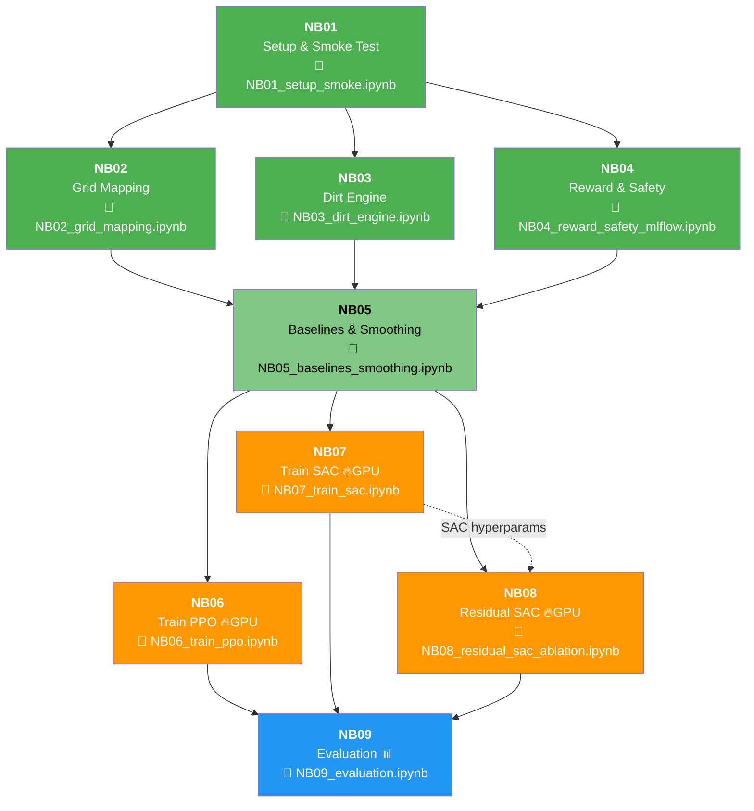

# 04 — คู่มือ Notebook (NB01–NB09) แบบละเอียด

> เอกสารนี้อธิบายทุก notebook อย่างละเอียด: ทำอะไร, ต้องมีอะไรก่อน, ได้อะไรออกมา, ปัญหาที่อาจเจอ

---

## สารบัญ

- [Dependency Graph](#dependency-graph)
- [NB01 — Setup & Smoke Test](#nb01--setup--smoke-test)
- [NB02 — Grid Mapping](#nb02--grid-mapping)
- [NB03 — Dirt Engine](#nb03--dirt-engine)
- [NB04 — Reward & Safety + MLflow](#nb04--reward--safety--mlflow)
- [NB05 — Baselines & Smoothing](#nb05--baselines--smoothing)
- [NB06 — Train PPO](#nb06--train-ppo)
- [NB07 — Train SAC](#nb07--train-sac)
- [NB08 — Residual SAC + Ablation](#nb08--residual-sac--ablation)
- [NB09 — Evaluation & Summary](#nb09--evaluation--summary)
- [สรุปตาราง I/O ทุก NB](#สรุปตาราง-io-ทุก-nb)

---

## Dependency Graph



---

## NB01 — Setup & Smoke Test

📁 `notebooks/NB01_setup_smoke.ipynb`

### Objective (ทำไมต้องมี)
ตรวจสอบว่าทุกอย่างพร้อมก่อนเริ่มทำงาน:
- Python version, OS, libraries ครบ
- Environment สร้างได้
- Observation/Action shape ถูกต้อง
- Contact API ทำงาน
- Dirt grid ทำงาน
- MLflow เชื่อมต่อได้

### Required Inputs
| สิ่งที่ต้องมี | ที่มา |
|-------------|------|
| Virtual environment (`.env/`) | ขั้นตอน setup |
| `src/envs/dishwipe_env.py` | source code |
| `src/envs/dirt_grid.py` | source code |
| `.env.local` (MLflow credentials) | สร้างเอง |

### Produced Outputs / Artifacts
| ไฟล์ | Path | คำอธิบาย |
|------|------|---------|
| `env_spec.json` | `artifacts/NB01/` | Obs/act shape, env_id, robot info |
| `active_joints.json` | `artifacts/NB01/` | รายชื่อ 25 active joints |
| `requirements.txt` | `artifacts/NB01/` | pip freeze snapshot |
| `contact_test.json` | `artifacts/NB01/` | Contact API test result |
| `nb01_config.json` | `artifacts/NB01/` | Config ที่ใช้ |
| `smoke_video.mp4` | `artifacts/NB01/` | (optional — ถ้า render ได้) |

### Key Config Knobs
```python
CFG = {
    "seed": 42,
    "env_id": "UnitreeG1DishWipe-v1",
    "control_mode": "pd_joint_delta_pos",
    "obs_mode": "state",
    "smoke_steps": 50,
}
```

### Expected Runtime
- **CPU**: 1–2 นาที
- **GPU**: 30 วินาที

### Common Pitfalls
| ปัญหา | สาเหตุ | วิธีแก้ |
|--------|--------|--------|
| `ModuleNotFoundError: No module named 'src'` | path ผิด | ตรวจว่า `sys.path.insert(0, PROJECT_ROOT)` ทำงาน |
| Render failed (Vulkan error) | ไม่มี GPU | ปกติ — มี try/except แล้ว ไม่กระทบผล |
| Obs shape ≠ 168 | env version ผิด | ตรวจว่า import `UnitreeG1DishWipeEnv` ก่อน `gym.make()` |

---

## NB02 — Grid Mapping

📁 `notebooks/NB02_grid_mapping.ipynb`

### Objective
ทดสอบระบบ mapping ระหว่าง world coordinate กับ dirt grid:
- แปลง world position → UV → cell index ถูกต้อง
- Contact detection ทำงาน
- zig-zag path ครอบคลุมทุก cell
- Visualization ของ grid before/after

### Required Inputs
| สิ่งที่ต้องมี | ที่มา |
|-------------|------|
| NB01 ผ่าน (env ใช้ได้) | NB01 |

### Produced Outputs / Artifacts
| ไฟล์ | Path | คำอธิบาย |
|------|------|---------|
| `grid_before.png` | `artifacts/NB02/` | Grid ก่อน cleaning |
| `grid_after.png` | `artifacts/NB02/` | Grid หลัง zig-zag clean |
| `grid_trace.csv` | `artifacts/NB02/` | zig-zag waypoint trace |
| `env_exploration_trace.csv` | `artifacts/NB02/` | Random exploration trace |
| `nb02_config.json` | `artifacts/NB02/` | Config |

### Key Config Knobs
```python
CFG = {
    "seed": 42,
    "grid_h": 10, "grid_w": 10,
    "brush_radius": 1,
    "sim_steps": 100,
    "n_explore": 200,
}
```

### Expected Runtime
- **CPU**: 1–2 นาที

### Common Pitfalls
| ปัญหา | สาเหตุ | วิธีแก้ |
|--------|--------|--------|
| Corner mapping ผิด | plate position เปลี่ยน | ตรวจ `PLATE_POS_IN_SINK` |
| Contact rate = 0% | Random action ไม่สัมผัสจาน | ปกติ — random ไม่ฉลาดพอ |

---

## NB03 — Dirt Engine

📁 `notebooks/NB03_dirt_engine.ipynb`

### Objective
ทดสอบ VirtualDirtGrid อย่างทั่วถึง:
- Brush radius effect (r=0, 1, 2)
- Cleaning progress tracking
- Coordinate mapping validation

### Required Inputs
| สิ่งที่ต้องมี | ที่มา |
|-------------|------|
| NB01 ผ่าน (env ใช้ได้) | NB01 |

### Produced Outputs / Artifacts
| ไฟล์ | Path | คำอธิบาย |
|------|------|---------|
| `brush_effect_demo.png` | `artifacts/NB03/` | Visualization ของ brush radius ต่างๆ |
| `cleaning_trace.csv` | `artifacts/NB03/` | ข้อมูล cleaning per step |
| `nb03_config.json` | `artifacts/NB03/` | Config |

### Key Config Knobs
```python
CFG = {
    "seed": 42,
    "grid_h": 10, "grid_w": 10,
    "brush_radii_to_test": [0, 1, 2],
    "env_test_steps": 50,
}
```

### Expected Runtime
- **CPU**: 1 นาที

### Common Pitfalls
| ปัญหา | สาเหตุ | วิธีแก้ |
|--------|--------|--------|
| `delta_clean = 0` ทุก step | Random action ไม่ contact | ปกติ — standalone test ยืนยัน grid ทำงานได้ |

---

## NB04 — Reward & Safety + MLflow

📁 `notebooks/NB04_reward_safety_mlflow.ipynb`

### Objective
- สร้าง **reward contract** (เอกสาร 9 terms + safety rules) เป็น JSON
- ทดสอบ safety termination conditions
- สร้าง MLflow helper functions สำหรับ NB ถัดไป
- รัน test episodes ด้วย random policy แล้วตรวจ reward range

### Required Inputs
| สิ่งที่ต้องมี | ที่มา |
|-------------|------|
| NB01 ผ่าน (env ใช้ได้) | NB01 |
| `.env.local` (MLflow creds) | สร้างเอง |

### Produced Outputs / Artifacts
| ไฟล์ | Path | คำอธิบาย |
|------|------|---------|
| `reward_contract.json` | `artifacts/NB04/` | Reward function spec ทั้งหมด |

### Key Config Knobs
```python
CFG = {
    "seed": 42,
    "test_episodes": 5,
    "test_steps_per_ep": 100,
}
```

### Expected Runtime
- **CPU**: 1–2 นาที

### Common Pitfalls
| ปัญหา | สาเหตุ | วิธีแก้ |
|--------|--------|--------|
| MLflow connection error | credentials ผิด | ตรวจ `.env.local` |
| Reward ≈ -0.006 | ปกติสำหรับ random policy | time+jerk+act penalty > reaching reward |

---

## NB05 — Baselines & Smoothing

📁 `notebooks/NB05_baselines_smoothing.ipynb`

### Objective
สร้าง baseline policies เพื่อเปรียบเทียบกับ RL:
1. **Random** — สุ่ม action
2. **Heuristic** — ชี้มือไปที่จาน (palm → plate)
3. **SmoothActionWrapper** — EMA smoothing (alpha=0.3)
4. **BaseController** — heuristic + EMA (สำหรับ NB08 Residual)
5. **Leaderboard** — ตารางเปรียบเทียบทุก baseline

### Required Inputs
| สิ่งที่ต้องมี | ที่มา |
|-------------|------|
| NB01–NB04 ผ่าน | NB01–NB04 |
| Reward contract | NB04 |

### Produced Outputs / Artifacts
| ไฟล์ | Path | คำอธิบาย |
|------|------|---------|
| `baseline_leaderboard.csv` | `artifacts/NB05/` | ตารางเปรียบเทียบ baselines |
| `nb05_config.json` | `artifacts/NB05/` | Config |

### Key Config Knobs
```python
CFG = {
    "seed": 42,
    "eval_episodes": 20,
    "eval_steps": 200,
    "smooth_alpha": 0.3,  # EMA สำหรับ SmoothActionWrapper
}
```

### Expected Runtime
- **CPU**: 5–15 นาที (หลาย episodes)
- **GPU**: 2–5 นาที

### Common Pitfalls
| ปัญหา | สาเหตุ | วิธีแก้ |
|--------|--------|--------|
| Heuristic cleaned = 0 | ยังไม่ถึงจาน 200 steps | เพิ่ม `eval_steps` |
| BaseController ไม่ smooth | alpha ต่ำ/สูงเกิน | ปรับ `smooth_alpha` (0.3 เหมาะ) |

---

## NB06 — Train PPO

📁 `notebooks/NB06_train_ppo.ipynb`

### Objective
เทรน **PPO** (Proximal Policy Optimization) ด้วย Stable-Baselines3:
- On-policy algorithm
- Vectorized env (4 envs บน GPU)
- Learning curve + evaluation

### Required Inputs
| สิ่งที่ต้องมี | ที่มา |
|-------------|------|
| NB05 ผ่าน (baselines สร้างแล้ว) | NB05 |
| **GPU** (strongly recommended) | RunPod |

### Produced Outputs / Artifacts
| ไฟล์ | Path | คำอธิบาย |
|------|------|---------|
| `ppo_model.zip` | `artifacts/NB06/` | Trained PPO model |
| `learning_curve.png` | `artifacts/NB06/` | Reward vs steps plot |
| `eval_results.json` | `artifacts/NB06/` | Final eval metrics |
| `train_log.csv` | `artifacts/NB06/` | Training log (every N steps) |

### Key Config Knobs
```python
CFG = {
    "seed": 42,
    "total_timesteps": 500_000,  # GPU / 20_000 CPU
    "n_envs": 4,                  # GPU / 1 CPU
    "learning_rate": 3e-4,
    "n_steps": 2048,
    "batch_size": 256,
    "n_epochs": 10,
    "clip_range": 0.2,
    "ent_coef": 0.01,
    "gamma": 0.99,
    "gae_lambda": 0.95,
    "net_arch": [256, 256],
}
```

### Expected Runtime
- **CPU**: หลายชั่วโมง (ไม่แนะนำ)
- **GPU (4090)**: 1–3 ชม.

### Common Pitfalls
| ปัญหา | สาเหตุ | วิธีแก้ |
|--------|--------|--------|
| `CUDA out of memory` | n_envs/batch_size ใหญ่ | ลด n_envs เป็น 2 |
| Reward ไม่ขึ้น | lr สูงเกิน / ent_coef ต่ำ | ลด lr, เพิ่ม ent_coef |
| Training ช้ามาก (CPU) | ใช้ CPU | ย้ายไป RunPod GPU |

> ⚠️ **ห้ามกด Run All** บนเครื่อง CPU — จะใช้เวลานานมาก

---

## NB07 — Train SAC

📁 `notebooks/NB07_train_sac.ipynb`

### Objective
เทรน **SAC** (Soft Actor-Critic) ด้วย SB3:
- Off-policy algorithm (มี replay buffer)
- ต้องการ env เดียว (ไม่ vectorize)
- Automatic entropy tuning

### Required Inputs
| สิ่งที่ต้องมี | ที่มา |
|-------------|------|
| NB05 ผ่าน | NB05 |
| **GPU** (strongly recommended) | RunPod |

### Produced Outputs / Artifacts
| ไฟล์ | Path | คำอธิบาย |
|------|------|---------|
| `sac_model.zip` | `artifacts/NB07/` | Trained SAC model |
| `learning_curve.png` | `artifacts/NB07/` | Reward vs steps plot |
| `eval_results.json` | `artifacts/NB07/` | Final eval metrics |
| `train_log.csv` | `artifacts/NB07/` | Training log |

### Key Config Knobs
```python
CFG = {
    "seed": 42,
    "total_timesteps": 500_000,  # GPU / 20_000 CPU
    "learning_rate": 3e-4,
    "buffer_size": 1_000_000,     # GPU / 50_000 CPU
    "batch_size": 256,
    "ent_coef": "auto",
    "tau": 0.005,
    "gamma": 0.99,
    "learning_starts": 1000,
    "net_arch": [256, 256],
}
```

### Expected Runtime
- **CPU**: หลายชั่วโมง (ไม่แนะนำ)
- **GPU (4090)**: 1–3 ชม.

### Common Pitfalls
| ปัญหา | สาเหตุ | วิธีแก้ |
|--------|--------|--------|
| `CUDA out of memory` | buffer_size ใหญ่ | ลด buffer_size |
| Reward ต่ำช่วงแรก | learning_starts ยังไม่ครบ | ปกติ — รอให้ผ่าน learning_starts |
| NaN loss | lr สูงเกิน | ลด lr เป็น 1e-4 |

---

## NB08 — Residual SAC + Ablation

📁 `notebooks/NB08_residual_sac_ablation.ipynb`

### Objective
เทรน **Residual SAC** — ใช้ BaseController (จาก NB05) เป็นฐาน แล้วให้ SAC เรียนรู้ "ส่วนเพิ่ม" (residual):

```
a_final = clip(a_base + β × a_residual, -1, 1)
```

- `a_base` = action จาก BaseController (heuristic + EMA)
- `a_residual` = action จาก SAC policy
- `β` = scaling factor (ablation: 0.25, 0.5, 1.0)

### ทำไมต้องใช้ Residual?
- BaseController มีพื้นฐานดี (เอื้อมถึงจาน) แต่ไม่ฉลาดพอจะล้างครบ
- SAC จาก 0 ต้องเรียนรู้ทุกอย่าง (เข้าใกล้ + สัมผัส + เช็ด)
- Residual: SAC แค่เรียนรู้ส่วนที่ BaseController ทำไม่ได้ → เรียนเร็วกว่า

### Required Inputs
| สิ่งที่ต้องมี | ที่มา |
|-------------|------|
| NB05 ผ่าน (BaseController) | NB05 |
| SAC hyperparams | NB07 config |
| **GPU** | RunPod |

### Produced Outputs / Artifacts
| ไฟล์ | Path | คำอธิบาย |
|------|------|---------|
| `residual_sac_beta0.25.zip` | `artifacts/NB08/` | Model β=0.25 |
| `residual_sac_beta0.5.zip` | `artifacts/NB08/` | Model β=0.5 |
| `residual_sac_beta1.0.zip` | `artifacts/NB08/` | Model β=1.0 |
| `ablation_beta_table.csv` | `artifacts/NB08/` | ตารางเปรียบเทียบ β |
| `ablation_plot.png` | `artifacts/NB08/` | Plot เปรียบเทียบ β |

### Key Config Knobs
```python
CFG = {
    "seed": 42,
    "total_timesteps": 500_000,
    "betas": [0.25, 0.5, 1.0],
    "sac_lr": 3e-4,
    "buffer_size": 1_000_000,
    "batch_size": 256,
    "smooth_alpha": 0.3,
}
```

### Expected Runtime
- **GPU (4090)**: 3–6 ชม. (3 runs × 1–2 ชม.)

### Common Pitfalls
| ปัญหา | สาเหตุ | วิธีแก้ |
|--------|--------|--------|
| β=1.0 ชนะทุก β | Budget ไม่พอ | เพิ่ม total_timesteps |
| BaseController ทำงานผิด | import ผิด version | ตรวจว่า import จาก NB05 ถูกต้อง |

---

## NB09 — Evaluation & Summary

📁 `notebooks/NB09_evaluation.ipynb`

### Objective
ประเมินผลทุก method อย่างเป็นระบบ:
1. Load models จาก NB06/07/08
2. Run deterministic evaluation (100 episodes per method)
3. คำนวณ **Bootstrap 95% CI** สำหรับทุก metric
4. สร้าง comparison plots
5. สร้าง video ของ best method (ถ้า render ได้)
6. สรุปผล

### Required Inputs
| สิ่งที่ต้องมี | ที่มา |
|-------------|------|
| `ppo_model.zip` | NB06 |
| `sac_model.zip` | NB07 |
| `residual_sac_beta*.zip` (best β) | NB08 |
| Baseline functions | NB05 |

### Produced Outputs / Artifacts
| ไฟล์ | Path | คำอธิบาย |
|------|------|---------|
| `eval_table.csv` | `artifacts/NB09/` | ผลรวมทุก method (mean ± CI) |
| `eval_comparison.png` | `artifacts/NB09/` | Bar chart เปรียบเทียบ |
| `ci_table.csv` | `artifacts/NB09/` | Bootstrap CI details |
| `best_method_video.mp4` | `artifacts/NB09/` | Video ของ method ดีที่สุด |
| `final_summary.json` | `artifacts/NB09/` | สรุปผลทั้งหมด |

### Metrics ที่ประเมิน
| Metric | คำอธิบาย | ดียิ่งขึ้นเมื่อ |
|--------|---------|-------------|
| `success_rate` | สัดส่วน episode ที่ล้างครบ 95% | สูง ↑ |
| `final_cleanliness` | cleaned_ratio ตอนจบ episode | สูง ↑ |
| `steps_to_95` | จำนวน step ที่ใช้ถึง 95% | ต่ำ ↓ |
| `mean_reward` | reward เฉลี่ยต่อ episode | สูง ↑ |
| `mean_jerk` | ‖aₜ − aₜ₋₁‖² เฉลี่ย | ต่ำ ↓ |
| `p95_jerk` | percentile 95 ของ jerk | ต่ำ ↓ |
| `mean_contact_force` | แรงเฉลี่ย (N) | ปานกลาง |
| `safety_violation_rate` | สัดส่วน episode ที่ force > hard limit | ต่ำ ↓ |

### Key Config Knobs
```python
CFG = {
    "seed": 42,
    "eval_episodes": 100,
    "bootstrap_samples": 1000,
    "confidence_level": 0.95,
    "deterministic": True,
}
```

### Expected Runtime
- **CPU**: 15–30 นาที
- **GPU**: 5–10 นาที

### Common Pitfalls
| ปัญหา | สาเหตุ | วิธีแก้ |
|--------|--------|--------|
| `FileNotFoundError: ppo_model.zip` | ยังไม่เทรน | รัน NB06 ก่อน |
| Video render fails | ไม่มี GPU | ใช้ fallback (สร้าง plot แทน video) |
| CI กว้างมาก | episodes น้อย | เพิ่ม eval_episodes |

---

## สรุปตาราง I/O ทุก NB

| NB | Input Files | Output Artifacts | Key Metric |
|----|-------------|------------------|------------|
| 01 | `src/envs/`, `.env.local` | `env_spec.json`, `active_joints.json` | obs=(1,168), act=(25,) |
| 02 | NB01 env | `grid_trace.csv`, `grid_*.png` | 100/100 cells mapped |
| 03 | NB01 env | `brush_effect_demo.png`, `cleaning_trace.csv` | radius=1 → 9 cells/touch |
| 04 | NB01 env, `.env.local` | `reward_contract.json` | reward ≈ -0.006 (random) |
| 05 | NB01–04 | `baseline_leaderboard.csv` | heuristic > random |
| 06 | NB05 | `ppo_model.zip`, `learning_curve.png` | reward ↑, cleaned ↑ |
| 07 | NB05 | `sac_model.zip`, `learning_curve.png` | reward ↑, cleaned ↑ |
| 08 | NB05, NB07 config | `residual_sac_beta*.zip`, `ablation_plot.png` | best β selection |
| 09 | NB06/07/08 models | `eval_table.csv`, `eval_comparison.png` | method comparison |

---

*ก่อนหน้า → [03 — Environment & Task](03_environment_and_task.md) | ต่อไป → [05 — RL Methods Tutorial](05_rl_methods_tutorial.md)*
