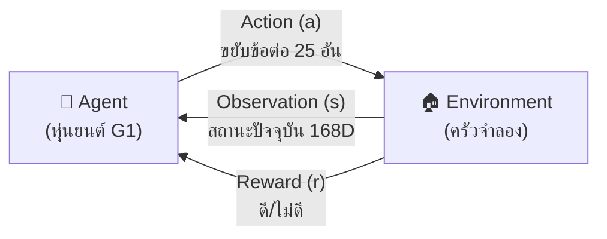
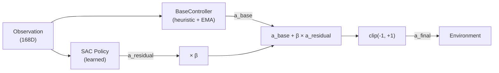
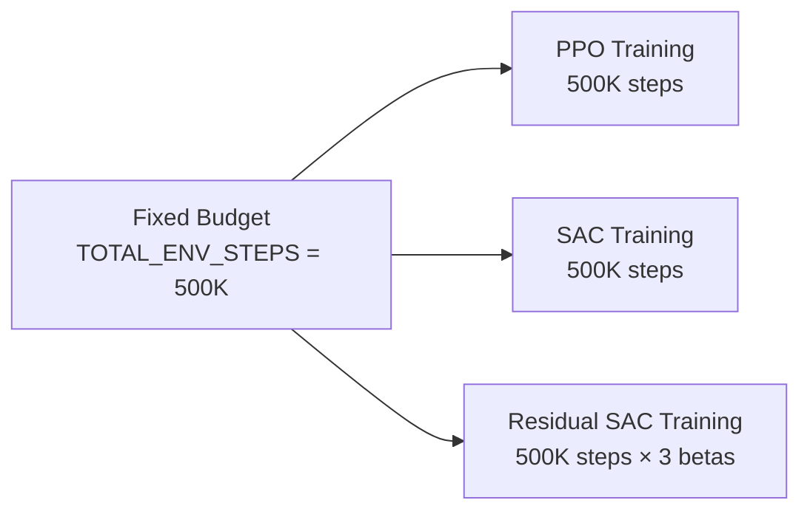

# 05 — RL Methods Tutorial (อธิบาย RL แบบเข้าใจง่าย)

> เอกสารนี้อธิบาย Reinforcement Learning พื้นฐาน, PPO, SAC, Residual Policy สำหรับมือใหม่

---

## สารบัญ

- [RL พื้นฐาน](#rl-พื้นฐาน)
- [PPO — Proximal Policy Optimization](#ppo--proximal-policy-optimization)
- [SAC — Soft Actor-Critic](#sac--soft-actorcritic)
- [Residual Policy Learning](#residual-policy-learning)
- [เปรียบเทียบ PPO vs SAC vs Residual](#เปรียบเทียบ-ppo-vs-sac-vs-residual)
- [Fairness ในการเปรียบเทียบ](#fairness-ในการเปรียบเทียบ)
- [Hyperparameters สำคัญ](#hyperparameters-สำคัญ)

---

## RL พื้นฐาน

### Reinforcement Learning คืออะไร?

RL เป็นวิธีสอนให้ **agent** (ในกรณีนี้คือหุ่นยนต์) เรียนรู้จากการ **ลองทำ** แล้วรับ **รางวัล (reward)** หรือ **ค่าปรับ (penalty)**

### องค์ประกอบหลัก



| คำศัพท์ | ความหมาย | ในโปรเจกต์นี้ |
|---------|---------|-------------|
| **State / Observation (s)** | สิ่งที่ agent เห็น | ตำแหน่งข้อต่อ, ตำแหน่ง palm, จาน, dirt grid (168 มิติ) |
| **Action (a)** | สิ่งที่ agent ทำ | ขยับข้อต่อ 25 อัน (delta position, -1 ถึง +1) |
| **Reward (r)** | feedback ดี/ไม่ดี | เช่น +10 เมื่อล้าง cell ใหม่, -0.01 ค่าปรับเวลา |
| **Episode** | "รอบ" หนึ่งตั้งแต่เริ่มจนจบ | เริ่ม: จานสกปรก → จบ: ล้างครบ 95% / timeout 1000 steps |
| **Policy (π)** | "กลยุทธ์" ของ agent | neural network ที่ input=obs, output=action |
| **Step** | 1 รอบของ action→obs→reward | ~0.05 วินาที simulation time |

### Training Loop (แบบง่าย)

```
for episode in range(N):
    obs = env.reset()
    while not done:
        action = policy(obs)        # ถาม neural network
        obs, reward, done, info = env.step(action)  # ทำ action
        # เก็บ experience → อัปเดต neural network
```

เป้าหมาย: ทำให้ **ผลรวม reward** ตลอด episode **สูงที่สุด**

---

## PPO — Proximal Policy Optimization

### แนวคิด
PPO เป็น **on-policy** algorithm: เก็บ experience → อัปเดต policy → ทิ้ง experience เก่า → เก็บใหม่

### วิธีทำงาน (อธิบายง่าย)

1. เล่น environment ด้วย policy ปัจจุบัน เก็บข้อมูล `n_steps` steps
2. คำนวณ "advantage" — step ไหนดีกว่าเฉลี่ย?
3. อัปเดต policy ให้ทำ action ที่ดีบ่อยขึ้น (แต่ **clip** ไว้ไม่ให้เปลี่ยนเยอะเกิน)
4. ทิ้งข้อมูลเก่า → กลับไปข้อ 1

### จุดเด่น
- **เสถียร**: clip range ป้องกัน policy เปลี่ยนแบบพลิกฟ้า
- **ง่ายในการ tune**: parameters ไม่เยอะ
- **Vectorize ได้**: เล่นหลาย env พร้อมกัน (เช่น 4 envs) → เร็วขึ้น
- **ใช้ GPU ได้ดี**: batch update บน GPU

### จุดอ่อน
- **Sample efficiency ต่ำ**: ใช้ data แล้วทิ้ง → ต้อง interact กับ env เยอะ
- **ไม่มี replay buffer**: ข้อมูลเก่าหายไป

### Parameters สำคัญ

| Parameter | ค่าในโปรเจกต์ | ความหมาย |
|-----------|-------------|----------|
| `learning_rate` | 3e-4 | อัตราการเรียนรู้ |
| `n_steps` | 2048 | จำนวน steps ก่อน update |
| `batch_size` | 256 | ขนาด mini-batch ตอน update |
| `n_epochs` | 10 | จำนวนรอบที่ใช้ data ชุดเดียวซ้ำ |
| `clip_range` | 0.2 | จำกัดการเปลี่ยน policy (PPO signature) |
| `ent_coef` | 0.01 | entropy bonus — กระตุ้น exploration |
| `gamma` | 0.99 | discount factor — ให้ความสำคัญอนาคต |
| `gae_lambda` | 0.95 | GAE smoothing — balance bias vs variance |

---

## SAC — Soft Actor-Critic

### แนวคิด
SAC เป็น **off-policy** algorithm: เก็บ experience ไว้ใน **replay buffer** แล้วดึงมาเรียนซ้ำได้

> คำว่า "Soft" มาจากการที่ SAC ไม่แค่ maximize reward แต่ maximize **reward + entropy**  
> Entropy = ความหลากหลายของ action → ทำให้ agent สำรวจ (explore) ได้ดีกว่า

### วิธีทำงาน (อธิบายง่าย)

1. เล่น environment → เก็บ `(obs, action, reward, next_obs)` ลง replay buffer
2. สุ่มหยิบ mini-batch จาก buffer
3. อัปเดต 3 neural networks พร้อมกัน:
   - **Actor** (policy): เลือก action → maximize reward + entropy
   - **Critic** (2 ตัว): ประเมินว่า action ดีแค่ไหน
4. อัปเดต entropy coefficient อัตโนมัติ (ถ้า `ent_coef="auto"`)
5. กลับไปข้อ 1

### จุดเด่น
- **Sample efficient**: ใช้ data ซ้ำได้ → เรียนไวกว่า PPO (ต่อ step)
- **Exploration ดี**: entropy term ทำให้ agent ไม่ติดอยู่กับ action เดิม
- **Off-policy**: ไม่ต้อง vectorize env — ใช้ env เดียวก็พอ
- **Automatic entropy tuning**: ไม่ต้อง tune ent_coef เอง

### จุดอ่อน
- **Memory สูง**: replay buffer 1M transitions กิน RAM เยอะ
- **ซับซ้อนกว่า PPO**: มี 5 networks (actor + 2 critics + 2 target critics)
- **Hyperparameter sensitive**: buffer_size, tau, learning_starts ต้องเหมาะสม

### Parameters สำคัญ

| Parameter | ค่าในโปรเจกต์ | ความหมาย |
|-----------|-------------|----------|
| `learning_rate` | 3e-4 | อัตราการเรียนรู้ |
| `buffer_size` | 1,000,000 | จำนวน transitions ใน replay buffer |
| `batch_size` | 256 | ขนาด mini-batch |
| `ent_coef` | "auto" | entropy coefficient (auto-tuned) |
| `tau` | 0.005 | อัตราการ soft-update target network |
| `gamma` | 0.99 | discount factor |
| `learning_starts` | 1000 | จำนวน steps ก่อนเริ่ม update (เก็บ data ก่อน) |

---

## Residual Policy Learning

### แนวคิดหลัก

แทนที่จะให้ SAC เรียนทุกอย่างจาก 0 เราให้มัน **ต่อยอด** จาก heuristic controller ที่ทำได้ดีพอสมควร

```
a_final = clip(a_base + β × a_residual, -1, +1)
```

- `a_base` = action จาก **BaseController** (NB05) — heuristic ที่ชี้มือไปที่จาน + EMA smooth
- `a_residual` = action จาก **SAC policy** — ส่วนที่ SAC เรียนรู้เพิ่ม
- `β` = scaling factor ที่ควบคุมว่า SAC มีอิทธิพลแค่ไหน

### ทำไมต้องใช้?

| ข้อดี | คำอธิบาย |
|------|---------|
| **เรียนเร็ว** | ไม่ต้องเรียน "เข้าใกล้จาน" จาก 0 — BaseController ทำได้อยู่แล้ว |
| **เสถียร** | ถ้า SAC ยังเรียนไม่ดี ก็ยังมี BaseController พยุง |
| **Explore ดีขึ้น** | SAC focus แค่ "ทำยังไงให้ดีกว่า heuristic" |

### β Ablation

เราทดลอง β 3 ค่า:

| β | ความหมาย |
|---|---------|
| **0.25** | SAC มีอิทธิพลน้อย — ส่วนใหญ่ใช้ base |
| **0.5** | balance ระหว่าง base กับ SAC |
| **1.0** | SAC มีอิทธิพลเท่ากับ base |

ค่า β ที่ดีที่สุดเลือกจาก **mean reward สูงสุด** แล้วนำไปใช้ใน NB09

### Diagram



---

## เปรียบเทียบ PPO vs SAC vs Residual

| คุณสมบัติ | PPO | SAC | Residual SAC |
|----------|-----|-----|-------------|
| **ประเภท** | On-policy | Off-policy | Off-policy + heuristic |
| **Replay buffer** | ไม่มี | มี (1M) | มี (1M) |
| **Sample efficiency** | ต่ำ | สูง | สูง |
| **Vectorized envs** | ดี (4+ envs) | ปกติ (1 env) | ปกติ (1 env) |
| **ความเสถียร** | สูง (clip) | ปานกลาง | สูง (มี base รองรับ) |
| **Exploration** | Entropy bonus | Auto entropy | Auto entropy + base guidance |
| **Memory** | ต่ำ | สูง | สูง |
| **จำนวน networks** | 2 (actor+critic) | 5 | 5 + BaseController |
| **ต่อยอดจาก heuristic** | ไม่ | ไม่ | ใช่ |

### คาดการณ์ผลลัพธ์ (hypothesis)

1. **PPO**: เรียนช้า แต่เสถียร อาจไม่บรรลุ 95% ภายใน 500K steps
2. **SAC**: เรียนเร็วกว่า PPO (sample efficient) อาจบรรลุ 95%
3. **Residual SAC**: เรียนเร็วที่สุด เพราะมี base ช่วย

> ผลจริงอาจแตกต่างขึ้นกับ hyperparameters และ seed!

---

## Fairness ในการเปรียบเทียบ

### Training Fairness



| กฎ | ทำไม |
|----|------|
| **TOTAL_ENV_STEPS เท่ากัน** | ให้ทุก algorithm "ฝึก" จำนวน step เท่ากัน |
| **EVAL_EPISODES เท่ากัน** | ทดสอบจำนวนเท่ากันเพื่อ statistical power |
| **SEEDS เหมือนกัน** | ลด variance จาก randomness |
| **control_mode เดียวกัน** | Input เหมือนกัน |
| **Deterministic eval** | ไม่ใช้ stochastic → ผล reproducible |

### Evaluation Fairness

- **PPO**: ใช้ `deterministic=True` (เลือก action ที่ probability สูงสุด)
- **SAC**: ใช้ `deterministic=True` (ใช้ mean action, ไม่สุ่มจาก distribution)
- **Residual SAC**: ใช้ `deterministic=True` + BaseController

---

## Hyperparameters สำคัญ

### ตารางรวม

| Parameter | PPO (NB06) | SAC (NB07) | Residual SAC (NB08) |
|-----------|-----------|-----------|-------------------|
| `total_timesteps` | 500K | 500K | 500K per β |
| `learning_rate` | 3e-4 | 3e-4 | 3e-4 |
| `batch_size` | 256 | 256 | 256 |
| `net_arch` | [256, 256] | [256, 256] | [256, 256] |
| `gamma` | 0.99 | 0.99 | 0.99 |
| `n_envs` | 4 | 1 | 1 |
| `n_steps` | 2048 | - | - |
| `clip_range` | 0.2 | - | - |
| `buffer_size` | - | 1M | 1M |
| `tau` | - | 0.005 | 0.005 |
| `ent_coef` | 0.01 | "auto" | "auto" |
| `β` | - | - | 0.25 / 0.5 / 1.0 |

### วิธี Tune (ถ้าผลไม่ดี)

1. **Reward ไม่ขึ้นเลย**: ลด `learning_rate` (เช่น 1e-4)
2. **Reward ขึ้นแล้วตก**: เพิ่ม `n_steps` (PPO) หรือ `buffer_size` (SAC)
3. **Agent ติดอยู่ไม่สำรวจ**: เพิ่ม `ent_coef` (PPO) หรือใช้ `"auto"` (SAC)
4. **CUDA OOM**: ลด `n_envs` หรือ `batch_size`
5. **Training ช้า**: เพิ่ม `n_envs` (PPO) หรือใช้ GPU ที่เร็วกว่า

---

*ก่อนหน้า → [04 — คู่มือ Notebook](04_notebook_guide.md) | ต่อไป → [06 — Experiment Tracking](06_experiment_tracking.md)*
