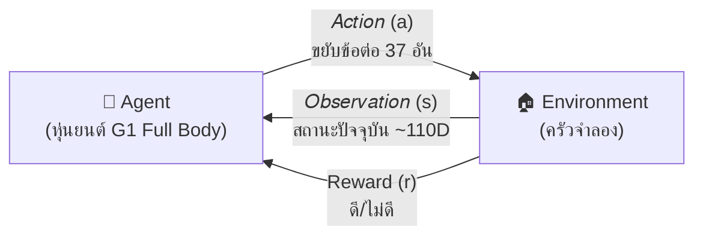
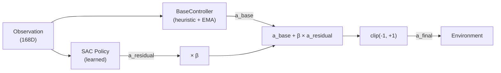
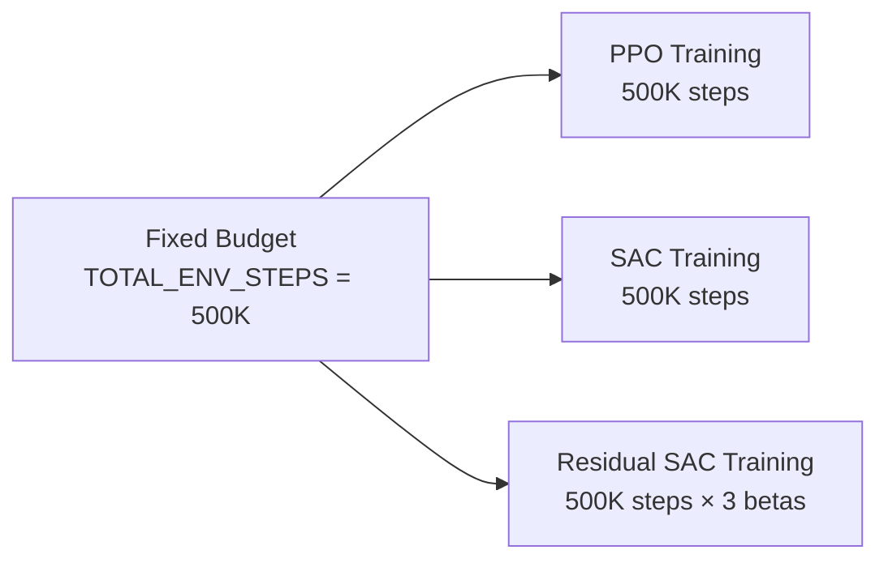

# 05 — RL Methods Tutorial (อธิบาย RL แบบเข้าใจง่าย)

> เอกสารนี้อธิบาย Reinforcement Learning พื้นฐาน, PPO, SAC, Residual Policy สำหรับมือใหม่  
> อ้างอิงเพิ่มเติม: [mikelopster — Reinforcement Learning](https://mikelopster.dev/excalidraw/preview?file=reinforcement_learning)

---

## สารบัญ

- [RL พื้นฐาน](#rl-พื้นฐาน)
- [สมการพื้นฐาน (MDP & Bellman)](#สมการพื้นฐาน-mdp--bellman)
- [PPO — Proximal Policy Optimization](#ppo--proximal-policy-optimization)
- [SAC — Soft Actor-Critic](#sac--soft-actorcritic)
- [Residual Policy Learning](#residual-policy-learning)
- [เปรียบเทียบ PPO vs SAC vs Residual](#เปรียบเทียบ-ppo-vs-sac-vs-residual)
- [Fairness ในการเปรียบเทียบ](#fairness-ในการเปรียบเทียบ)
- [Hyperparameters สำคัญ](#hyperparameters-สำคัญ)
- [ข้อจำกัดของ Gymnasium, ManiSkill และ Unitree](#ข้อจำกัดของ-gymnasium-maniskill-และ-unitree)

---

## RL พื้นฐาน

### Reinforcement Learning คืออะไร?

RL เป็นวิธีสอนให้ **agent** (ในกรณีนี้คือหุ่นยนต์) เรียนรู้จากการ **ลองทำ** แล้วรับ **รางวัล (reward)** หรือ **ค่าปรับ (penalty)**

### องค์ประกอบหลัก



| คำศัพท์ | ความหมาย | ในโปรเจกต์นี้ |
|---------|---------|-------------|
| **State / Observation (s)** | สิ่งที่ agent เห็น | ตำแหน่งข้อต่อ, TCP, apple, bowl (~110+ มิติ) |
| **Action (a)** | สิ่งที่ agent ทำ | ขยับข้อต่อ 37 อัน (delta position, -1 ถึง +1) |
| **Reward (r)** | feedback ดี/ไม่ดี | เช่น +10 เมื่อล้าง cell ใหม่, -0.01 ค่าปรับเวลา |
| **Episode** | "รอบ" หนึ่งตั้งแต่เริ่มจนจบ | เริ่ม: แอปเปิลบนโต๊ะ → จบ: วางในชาม / timeout 100 steps |
| **Policy (π)** | "กลยุทธ์" ของ agent | neural network ที่ input=obs, output=action |
| **Step** | 1 รอบของ action→obs→reward | ~0.05 วินาที simulation time |

### Training Loop (แบบง่าย)

```
for episode in range(N):
    obs = env.reset()
    while not done:
        action = policy(obs)        # ถาม neural network
        obs, reward, done, info = env.step(action)  # ทำ action
        # เก็บ experience → อัปเดต neural network
```

เป้าหมาย: ทำให้ **ผลรวม reward** ตลอด episode **สูงที่สุด**

---

## สมการพื้นฐาน (MDP & Bellman)

### Markov Decision Process (MDP)

RL สามารถ formalize เป็น MDP tuple $(S, A, P, R, \gamma)$:

| สัญลักษณ์ | ความหมาย | ในโปรเจกต์นี้ |
|-----------|---------|-------------|
| $S$ | State space | ~110+ dimensions (qpos, tcp, apple, bowl...) |
| $A$ | Action space | $[-1, 1]^{37}$ (joint delta position, full body) |
| $P(s' \mid s,a)$ | Transition probability | physics simulation (SAPIEN) |
| $R(s,a)$ | Reward function | Staged dense reward (reach→grasp→place→release) |
| $\gamma$ | Discount factor | 0.99 |

### Return & Objective

**Discounted Return** — ผลรวม reward ที่มีส่วนลด:

$$G_t = \sum_{k=0}^{\infty} \gamma^k r_{t+k}$$

**Objective** — ต้องการ policy $\pi$ ที่ maximize expected return:

$$\pi^* = \arg\max_\pi \; \mathbb{E}_{\pi} \left[ \sum_{t=0}^{T} \gamma^t r_t \right]$$

### Bellman Equation

**Value Function** — expected return เมื่ออยู่ที่ state $s$:

$$V^\pi(s) = \mathbb{E}_\pi \left[ r_t + \gamma V^\pi(s_{t+1}) \mid s_t = s \right]$$

**Action-Value Function** (Q-function):

$$Q^\pi(s, a) = \mathbb{E}_\pi \left[ r_t + \gamma V^\pi(s_{t+1}) \mid s_t = s, a_t = a \right]$$

> SAC ใช้ Q-function โดยตรง ส่วน PPO ใช้ **Advantage** $A(s,a) = Q(s,a) - V(s)$

---

## PPO — Proximal Policy Optimization

### แนวคิด
PPO เป็น **on-policy** algorithm: เก็บ experience → อัปเดต policy → ทิ้ง experience เก่า → เก็บใหม่

### วิธีทำงาน (อธิบายง่าย)

1. เล่น environment ด้วย policy ปัจจุบัน เก็บข้อมูล `n_steps` steps
2. คำนวณ "advantage" — step ไหนดีกว่าเฉลี่ย?
3. อัปเดต policy ให้ทำ action ที่ดีบ่อยขึ้น (แต่ **clip** ไว้ไม่ให้เปลี่ยนเยอะเกิน)
4. ทิ้งข้อมูลเก่า → กลับไปข้อ 1

### สมการหลัก

**Clipped Surrogate Objective:**

$$L^{\text{CLIP}}(\theta) = \mathbb{E}_t \left[ \min\left( r_t(\theta) \hat{A}_t, \; \text{clip}(r_t(\theta), 1-\epsilon, 1+\epsilon) \hat{A}_t \right) \right]$$

โดย:
- $r_t(\theta) = \frac{\pi_\theta(a_t|s_t)}{\pi_{\theta_{\text{old}}}(a_t|s_t)}$ — probability ratio
- $\hat{A}_t$ — advantage estimate (GAE)
- $\epsilon = 0.2$ (clip_range) — ป้องกัน policy เปลี่ยนมากเกิน

> ถ้า $r_t$ เปลี่ยนห่างจาก 1 มาก (คือ policy เปลี่ยนเยอะ) → clip จะตัดไม่ให้เกิน $1 \pm 0.2$ → policy เปลี่ยนทีละนิด

**Generalized Advantage Estimation (GAE):**

$$\hat{A}_t = \sum_{l=0}^{T-t} (\gamma \lambda)^l \delta_{t+l}$$

$$\delta_t = r_t + \gamma V(s_{t+1}) - V(s_t)$$

โดย $\gamma = 0.99$ (discount), $\lambda = 0.95$ (gae_lambda)

### จุดเด่น
- **เสถียร**: clip range ป้องกัน policy เปลี่ยนแบบพลิกฟ้า
- **ง่ายในการ tune**: parameters ไม่เยอะ
- **Vectorize ได้**: เล่นหลาย env พร้อมกัน (เช่น 4 envs) → เร็วขึ้น
- **ใช้ GPU ได้ดี**: batch update บน GPU

### จุดอ่อน
- **Sample efficiency ต่ำ**: ใช้ data แล้วทิ้ง → ต้อง interact กับ env เยอะ
- **ไม่มี replay buffer**: ข้อมูลเก่าหายไป

### Parameters สำคัญ

| Parameter | ค่าในโปรเจกต์ | ความหมาย |
|-----------|-------------|----------|
| `learning_rate` | 3e-4 → 1e-5 (linear decay) | อัตราการเรียนรู้ |
| `n_steps` | 2048 | จำนวน steps ก่อน update |
| `batch_size` | 2048 | ขนาด mini-batch ตอน update |
| `n_epochs` | 10 | จำนวนรอบที่ใช้ data ชุดเดียวซ้ำ |
| `clip_range` | 0.2 | จำกัดการเปลี่ยน policy (PPO signature) |
| `ent_coef` | 0.01 | entropy bonus — กระตุ้น exploration |
| `gamma` | 0.99 | discount factor — ให้ความสำคัญอนาคต |
| `gae_lambda` | 0.95 | GAE smoothing — balance bias vs variance |
| `net_arch` | [512, 512] ReLU | ขนาด network (~790K params) |
| `n_envs` | 64 | GPU-vectorized parallel envs |
| `VecNormalize` | norm_obs + norm_reward | ทำให้ training เสถียร |

---

## SAC — Soft Actor-Critic

### แนวคิด
SAC เป็น **off-policy** algorithm: เก็บ experience ไว้ใน **replay buffer** แล้วดึงมาเรียนซ้ำได้

> คำว่า "Soft" มาจากการที่ SAC ไม่แค่ maximize reward แต่ maximize **reward + entropy**  
> Entropy = ความหลากหลายของ action → ทำให้ agent สำรวจ (explore) ได้ดีกว่า

### วิธีทำงาน (อธิบายง่าย)

1. เล่น environment → เก็บ `(obs, action, reward, next_obs)` ลง replay buffer
2. สุ่มหยิบ mini-batch จาก buffer
3. อัปเดต 3 neural networks พร้อมกัน:
   - **Actor** (policy): เลือก action → maximize reward + entropy
   - **Critic** (2 ตัว): ประเมินว่า action ดีแค่ไหน
4. อัปเดต entropy coefficient อัตโนมัติ (ถ้า `ent_coef="auto"`)
5. กลับไปข้อ 1

### สมการหลัก

**Soft Bellman Equation** (เพิ่ม entropy term):

$$Q^\pi(s, a) = r(s,a) + \gamma \; \mathbb{E}_{s'} \left[ V^\pi(s') \right]$$

$$V^\pi(s) = \mathbb{E}_{a \sim \pi}\left[ Q^\pi(s,a) - \alpha \log \pi(a|s) \right]$$

**Actor Loss** (maximize Q + entropy):

$$J_\pi(\phi) = \mathbb{E}_{s \sim \mathcal{D}} \left[ \mathbb{E}_{a \sim \pi_\phi} \left[ \alpha \log \pi_\phi(a|s) - Q_\theta(s, a) \right] \right]$$

**Twin Q Critic** (ใช้ $\min$ ลด overestimation):

$$y = r + \gamma \left( \min_{i=1,2} Q_{\bar{\theta}_i}(s', a') - \alpha \log \pi(a'|s') \right)$$

**Soft Target Update:**

$$\bar{\theta} \leftarrow \tau \theta + (1 - \tau) \bar{\theta}, \quad \tau = 0.005$$

**Automatic Entropy Tuning:**

เมื่อ `ent_coef="auto"` SB3 จะปรับ $\alpha$ อัตโนมัติ:

$$J(\alpha) = \mathbb{E}_{a \sim \pi} \left[ -\alpha \left( \log \pi(a|s) + \bar{\mathcal{H}} \right) \right]$$

โดย $\bar{\mathcal{H}} = -\dim(A) = -25$ (target entropy)

### จุดเด่น
- **Sample efficient**: ใช้ data ซ้ำได้ → เรียนไวกว่า PPO (ต่อ step)
- **Exploration ดี**: entropy term ทำให้ agent ไม่ติดอยู่กับ action เดิม
- **Off-policy**: ไม่ต้อง vectorize env — ใช้ env เดียวก็พอ
- **Automatic entropy tuning**: ไม่ต้อง tune ent_coef เอง

### จุดอ่อน
- **Memory สูง**: replay buffer 1M transitions กิน RAM เยอะ
- **ซับซ้อนกว่า PPO**: มี 5 networks (actor + 2 critics + 2 target critics)
- **Hyperparameter sensitive**: buffer_size, tau, learning_starts ต้องเหมาะสม

### Parameters สำคัญ

| Parameter | ค่าในโปรเจกต์ | ความหมาย |
|-----------|-------------|----------|
| `learning_rate` | 3e-4 → 1e-5 (linear decay) | อัตราการเรียนรู้ |
| `buffer_size` | 10,000,000 (10M) | จำนวน transitions ใน replay buffer |
| `batch_size` | 1024 | ขนาด mini-batch |
| `ent_coef` | "auto" | entropy coefficient (auto-tuned) |
| `tau` | 0.005 | อัตราการ soft-update target network |
| `gamma` | 0.99 | discount factor |
| `learning_starts` | 10,000 | จำนวน steps ก่อนเริ่ม update (เก็บ data ก่อน) |
| `net_arch` | [512, 512] ReLU | ขนาด network (~790K params) |
| `VecNormalize` | norm_obs + norm_reward | ทำให้ training เสถียร |

---

## Residual Policy Learning

### แนวคิดหลัก

แทนที่จะให้ SAC เรียนทุกอย่างจาก 0 เราให้มัน **ต่อยอด** จาก heuristic controller ที่ทำได้ดีพอสมควร

### สมการหลัก

$$a_{\text{final}} = \text{clip}\left(a_{\text{base}} + \beta \cdot a_{\text{residual}},\; -1,\; +1\right)$$

โดย:
- $a_{\text{base}} = \text{BaseController}(s)$ — heuristic + EMA (NB05)
- $a_{\text{residual}} = \pi_\theta(s)$ — SAC policy (เรียนรู้)
- $\beta \in \{0.1, 0.25, 0.5, 0.75, 1.0\}$ — scaling factor (5 variants)

**EMA Smoothing ใน BaseController:**

$$\bar{a}_t = \alpha \cdot a_t^{\text{raw}} + (1 - \alpha) \cdot \bar{a}_{t-1}, \quad \alpha = 0.3$$

**Gradient ไหลผ่าน residual เท่านั้น:**

$$\nabla_\theta J = \nabla_\theta \; \mathbb{E}\left[ Q(s, a_{\text{base}} + \beta \pi_\theta(s)) \right]$$

SAC เรียนรู้ "residual" โดย gradient ไหลผ่าน Q-function ไปยัง policy parameters — base controller เป็นแค่ offset ที่คงที่

```
a_final = clip(a_base + β × a_residual, -1, +1)
```

- `a_base` = action จาก **BaseController** (NB05) — heuristic ที่ชี้มือไปที่จาน + EMA smooth
- `a_residual` = action จาก **SAC policy** — ส่วนที่ SAC เรียนรู้เพิ่ม
- `β` = scaling factor ที่ควบคุมว่า SAC มีอิทธิพลแค่ไหน

### ทำไมต้องใช้?

| ข้อดี | คำอธิบาย |
|------|---------|
| **เรียนเร็ว** | ไม่ต้องเรียน "เข้าใกล้จาน" จาก 0 — BaseController ทำได้อยู่แล้ว |
| **เสถียร** | ถ้า SAC ยังเรียนไม่ดี ก็ยังมี BaseController พยุง |
| **Explore ดีขึ้น** | SAC focus แค่ "ทำยังไงให้ดีกว่า heuristic" |

### β Ablation

เราทดลอง β 5 ค่า:

| β | ความหมาย |
|---|----------|
| **0.10** | SAC มีอิทธิพลน้อยมาก — แทบใช้ base ทั้งหมด |
| **0.25** | SAC มีอิทธิพลน้อย — ส่วนใหญ่ใช้ base |
| **0.50** | balance ระหว่าง base กับ SAC |
| **0.75** | SAC มีอิทธิพลมากขึ้น |
| **1.00** | SAC มีอิทธิพลเท่ากับ base |

ค่า β ที่ดีที่สุดเลือกจาก **mean reward สูงสุด** แล้วนำไปใช้ใน NB09

### Diagram



---

## เปรียบเทียบ PPO vs SAC vs Residual

| คุณสมบัติ | PPO | SAC | Residual SAC |
|----------|-----|-----|-------------|
| **ประเภท** | On-policy | Off-policy | Off-policy + heuristic |
| **Replay buffer** | ไม่มี | มี (10M) | มี (10M) |
| **Sample efficiency** | ต่ำ | สูง | สูง |
| **Vectorized envs** | ดี (64 envs) | ปกติ (1 env) | ปกติ (1 env) |
| **ความเสถียร** | สูง (clip) | ปานกลาง | สูง (มี base รองรับ) |
| **Exploration** | Entropy bonus | Auto entropy | Auto entropy + base guidance |
| **Memory** | ต่ำ | สูง | สูง |
| **จำนวน networks** | 2 (actor+critic) | 5 | 5 + BaseController |
| **ต่อยอดจาก heuristic** | ไม่ | ไม่ | ใช่ |

### คาดการณ์ผลลัพธ์ (hypothesis)

1. **PPO**: เรียนช้า แต่เสถียร อาจไม่บรรลุ convergence ภายใน 2M steps
2. **SAC**: เรียนเร็วกว่า PPO (sample efficient) อาจบรรลุ
3. **Residual SAC**: เรียนเร็วที่สุด เพราะมี base ช่วย

> ผลจริงอาจแตกต่างขึ้นกับ hyperparameters และ seed!

---

## Fairness ในการเปรียบเทียบ

### Training Fairness



| กฎ | ทำไม |
|----|------|
| **TOTAL_ENV_STEPS เท่ากัน** | ให้ทุก algorithm "ฝึก" จำนวน step เท่ากัน (2M) |
| **EVAL_EPISODES เท่ากัน** | ทดสอบจำนวนเท่ากันเพื่อ statistical power (200 eps) |
| **SEEDS เหมือนกัน** | ลด variance จาก randomness |
| **control_mode เดียวกัน** | Input เหมือนกัน |
| **Deterministic eval** | ไม่ใช้ stochastic → ผล reproducible |

### Evaluation Fairness

- **PPO**: ใช้ `deterministic=True` (เลือก action ที่ probability สูงสุด)
- **SAC**: ใช้ `deterministic=True` (ใช้ mean action, ไม่สุ่มจาก distribution)
- **Residual SAC**: ใช้ `deterministic=True` + BaseController

---

## Hyperparameters สำคัญ

### ตารางรวม

| Parameter | PPO (NB06) | SAC (NB07) | Residual SAC (NB08) |
|-----------|-----------|-----------|-------------------|
| `total_timesteps` | 2M | 2M | 2M per β |
| `learning_rate` | 3e-4→1e-5 | 3e-4→1e-5 | 3e-4→1e-5 |
| `batch_size` | 2048 | 1024 | 1024 |
| `net_arch` | [512, 512] ReLU | [512, 512] ReLU | [512, 512] ReLU |
| `gamma` | 0.99 | 0.99 | 0.99 |
| `n_envs` | 64 | 1 | 1 |
| `n_steps` | 2048 | - | - |
| `clip_range` | 0.2 | - | - |
| `buffer_size` | - | 10M | 10M |
| `tau` | - | 0.005 | 0.005 |
| `ent_coef` | 0.01 | "auto" | "auto" |
| `VecNormalize` | ✓ | ✓ | ✓ |
| `β` | - | - | 0.1 / 0.25 / 0.5 / 0.75 / 1.0 |

### วิธี Tune (ถ้าผลไม่ดี)

1. **Reward ไม่ขึ้นเลย**: ลด `learning_rate` (เช่น 1e-4)
2. **Reward ขึ้นแล้วตก**: เพิ่ม `n_steps` (PPO) หรือ `buffer_size` (SAC)
3. **Agent ติดอยู่ไม่สำรวจ**: เพิ่ม `ent_coef` (PPO) หรือใช้ `"auto"` (SAC)
4. **CUDA OOM**: ลด `n_envs` หรือ `batch_size`
5. **Training ช้า**: เพิ่ม `n_envs` (PPO) หรือใช้ GPU ที่เร็วกว่า

---

*ก่อนหน้า → [04 — คู่มือ Notebook](04_notebook_guide.md) | ต่อไป → [06 — Experiment Tracking](06_experiment_tracking.md)*

---

## ข้อจำกัดของ Gymnasium, ManiSkill และ Unitree

โปรเจกต์นี้ใช้ 3 framework หลัก แต่ละตัวมีข้อจำกัดที่ต้องตระหนัก:

### Gymnasium (OpenAI Gym)

> 🔗 [github.com/openai/gym](https://github.com/openai/gym) → เปลี่ยนเป็น [github.com/Farama-Foundation/Gymnasium](https://github.com/Farama-Foundation/Gymnasium)

| ข้อจำกัด | ผลกระทบ | วิธีรับมือในโปรเจกต์ |
|----------|-----------|-----------------|
| **gym ยกเลิกการพัฒนา** (v0.26+) | API อาจเปลี่ยนแปลง | ใช้ `gymnasium 0.29.1` (ไม่ใช้ `gym` เก่า) |
| **Single-env API** | ไม่มี native vectorization | ManiSkill จัดการให้ (`num_envs`) |
| **Float64 เป็น default** | ช้า ต้องแปลงเป็น Float32 | ManiSkill obs เป็น Float32 อยู่แล้ว |
| **Dict obs ไม่รองรับ SB3 MlpPolicy** | ต้องใช้ MultiInputPolicy | ใช้ `obs_mode="state"` เพื่อ flatten อัตโนมัติ |
| **ไม่มี physics engine** | ต้องใช้ simulation ข้างนอก | ใช้ SAPIEN ผ่าน ManiSkill |
| **render โหมด `human` เท่านั้น** | ไม่เหมาะกับ headless server | ใช้ `render_mode="rgb_array"` + EGL |

### ManiSkill 3

> 🔗 [github.com/haosulab/ManiSkill](https://github.com/haosulab/ManiSkill)

| ข้อจำกัด | ผลกระทบ | วิธีรับมือในโปรเจกต์ |
|----------|-----------|-----------------|
| **Beta (3.0.0b22)** | API ยังอาจเปลี่ยน | Pin version ใน requirements.txt |
| **Vulkan จำเป็นสำหรับ render** | CPU-only รันเดอร์ไม่ได้ | ใช้ try/except, training ไม่ต้อง render |
| **GPU memory สูง** | SAPIEN physics + contacts | ตั้ง `GPUMemoryConfig` ให้พอ |
| **Contact API ซับซ้อน** | `get_pairwise_contact_forces` จำเป็น | ใช้ multi-link detection 4 links |
| **obs เป็น dict ก่อน flatten** | ต้องเข้าใจโครงสร้าง | `obs_mode="state"` flatten อัตโนมัติ ได้ 168D |
| **Kitchen scene ไม่มีอ่างล้างจาน** | ต้องสร้าง plate เอง | สร้าง kinematic box actor |
| **ไม่รองรับ deformable body** | ฟองน้ำ/สบู่ทำไม่ได้ | ใช้ VirtualDirtGrid แทน |
| **`@register_env` ต้อง import ก่อน `gym.make()`** | ลืม import ก็ NameNotFound | NB ทุกตัวมี import guard |

### Unitree G1 (Robot)

> 🔗 [github.com/unitreerobotics](https://github.com/unitreerobotics)

| ข้อจำกัด | ผลกระทบ | วิธีรับมือในโปรเจกต์ |
|----------|-----------|-----------------|
| **Full body (37 DOF)** | ต้องทรงตัว + ทำงาน | เพิ่ม balance reward/penalty |
| **Free-floating root** | อาจล้มได้ | `is_fallen()` → terminate + penalty |
| **นิ้วมือ simplified** | ไม่มี individual finger control | ใช้ palm + finger links รวมกัน |
| **37 DOF — action space ใหญ่มาก** | เรียนรู้ช้ากว่า 6-7 DOF arm | RL ต้องการ steps เยอะ (≥500K) |
| **ไม่มี force/torque sensor** | ใช้ pairwise contact force แทน | `get_pairwise_contact_forces()` |
| **Self-collision** | ขาอาจชนแขน, นิ้วชนกัน | Jerk + act penalty ช่วยลด |

### ข้อจำกัดร่วมที่ต้องระวัง

1. **Sim-to-Real gap** — model ที่เทรนใน simulation อาจทำงานได้ไม่ดีบนหุ่นยนต์จริง
2. **Camera/vision ไม่ได้ใช้** — ใช้ `obs_mode="state"` (เห็นทุกอย่าง) ไม่ใช่ vision-based
3. **Single-arm only** — ใช้แค่มือเดียวในการทำงาน
4. **Balance เป็นความท้าทายหลัก** — full body G1 ต้องเรียนการทรงตัวไปพร้อมกับทำ task

> ข้อจำกัดเหล่านี้ไม่ได้ส่งผลต่อการเปรียบเทียบ algorithms — ทุกวิธีใช้ env เดียวกันจึง fair

---

*ก่อนหน้า → [04 — คู่มือ Notebook](04_notebook_guide.md) | ต่อไป → [06 — Experiment Tracking](06_experiment_tracking.md)*
