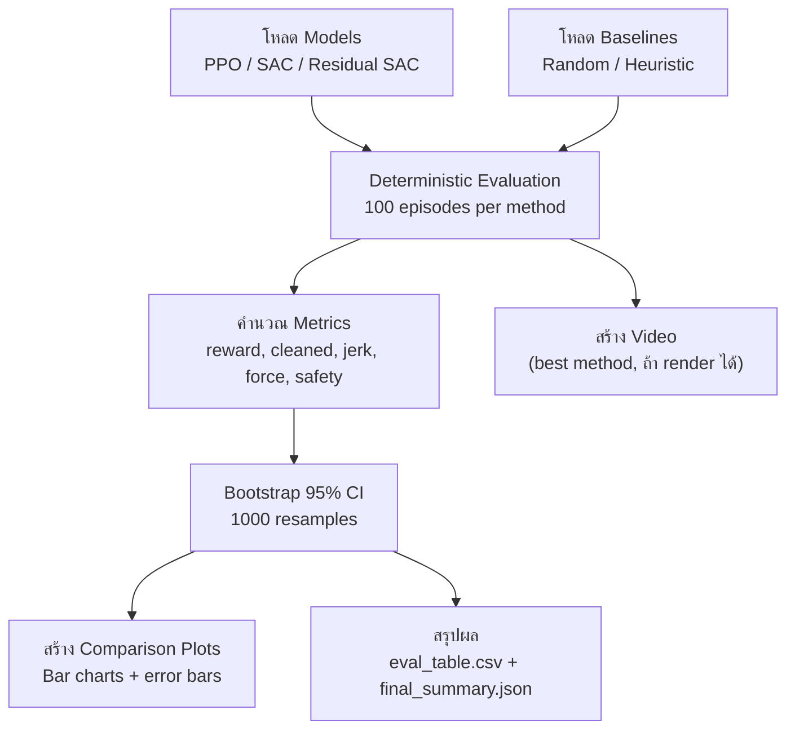

# 07 — Evaluation & Reporting (NB09 Pipeline)

> เอกสารนี้อธิบาย evaluation pipeline แบบละเอียด: metrics, bootstrap CI, video, สรุปผล

---

## สารบัญ

- [ภาพรวม Evaluation Pipeline](#ภาพรวม-evaluation-pipeline)
- [Metrics ที่ประเมิน](#metrics-ที่ประเมิน)
- [Deterministic Evaluation](#deterministic-evaluation)
- [Bootstrap Confidence Interval](#bootstrap-confidence-interval)
- [Comparison Plots](#comparison-plots)
- [Video Recording](#video-recording)
- [วิธีอ่านผลลัพธ์](#วิธีอ่านผลลัพธ์)
- [Troubleshooting](#troubleshooting)

---

## ภาพรวม Evaluation Pipeline



### Methods ที่ประเมิน

| Method | Source | Episodes |
|--------|--------|----------|
| Random | NB05 (function) | 20 |
| Heuristic | NB05 (function) | 20 |
| PPO | NB06 (`ppo_model.zip`) | 100 |
| SAC | NB07 (`sac_model.zip`) | 100 |
| Residual SAC (best β) | NB08 (`residual_sac_beta*.zip`) | 100 |

---

## Metrics ที่ประเมิน

### Primary Metrics (สำคัญที่สุด)

| Metric | คำอธิบาย | ดียิ่งขึ้นเมื่อ | สูตร |
|--------|---------|------------|-----|
| **success_rate** | สัดส่วน episode ที่ล้างครบ ≥95% | สูง ↑ | `count(cleaned ≥ 0.95) / total_episodes` |
| **final_cleanliness** | cleaned_ratio เฉลี่ยตอนจบ | สูง ↑ | `mean(cleaned_ratio at terminal step)` |
| **mean_reward** | reward รวมเฉลี่ยต่อ episode | สูง ↑ | `mean(sum of rewards per episode)` |

### Secondary Metrics (คุณภาพการเคลื่อนไหว)

| Metric | คำอธิบาย | ดียิ่งขึ้นเมื่อ | สูตร |
|--------|---------|------------|-----|
| **steps_to_95** | จำนวน step จนล้างครบ 95% (เฉพาะ episode ที่สำเร็จ) | ต่ำ ↓ | `mean(step where cleaned ≥ 0.95)` |
| **mean_jerk** | ‖aₜ − aₜ₋₁‖² เฉลี่ย | ต่ำ ↓ | `mean(||action_diff||^2)` |
| **p95_jerk** | percentile 95 ของ jerk | ต่ำ ↓ | `percentile(all_jerks, 95)` |
| **mean_contact_force** | แรงสัมผัสเฉลี่ย (N) | ปานกลาง | `mean(contact_force per step)` |
| **p95_contact_force** | percentile 95 ของแรง (N) | ต่ำ ↓ | `percentile(forces, 95)` |

### Safety Metrics

| Metric | คำอธิบาย | ดียิ่งขึ้นเมื่อ |
|--------|---------|------------|
| **safety_violation_rate** | สัดส่วน episode ที่ force > FZ_HARD (200N) | ต่ำ ↓ |
| **soft_violation_count** | จำนวน step ที่ force > FZ_SOFT (50N) | ต่ำ ↓ |

---

## Deterministic Evaluation

### ทำไมต้อง Deterministic?

ตอน training, policy มี **noise/stochasticity** เพื่อ explore  
ตอน eval ต้องใช้ **deterministic** เพื่อให้ผล **reproducible** และ **fair**

| Algorithm | Deterministic Mode |
|-----------|--------------------|
| **PPO** | เลือก action ที่ probability สูงสุด (mode ของ distribution) |
| **SAC** | ใช้ mean ของ Gaussian (ไม่ sample จาก distribution) |
| **Residual SAC** | SAC ใช้ mean + BaseController ใช้ค่าปกติ |

### Code Pattern

```python
from stable_baselines3 import PPO

model = PPO.load("artifacts/NB06/ppo_model.zip")

obs, _ = env.reset(seed=42)
rewards = []
for step in range(max_steps):
    action, _ = model.predict(obs, deterministic=True)  # deterministic!
    obs, reward, terminated, truncated, info = env.step(action)
    rewards.append(reward)
    if terminated or truncated:
        break
```

---

## Bootstrap Confidence Interval

### Bootstrap CI คืออะไร?

เมื่อเรารัน 100 episodes ได้ metric เฉลี่ย แต่ค่านี้อาจ **ผันผวน** ถ้าเรารันอีกครั้ง  
Bootstrap CI บอกว่า "ค่าจริงน่าจะอยู่ในช่วงนี้ด้วยความมั่นใจ 95%"

### วิธีทำ (อธิบายง่าย)

1. มี data = [reward₁, reward₂, ..., reward₁₀₀] จาก 100 episodes
2. **Resample**: สุ่มหยิบ 100 ค่า (แบบมีการซ้ำ) → คำนวณ mean
3. ทำซ้ำ 1,000 ครั้ง → ได้ 1,000 ค่า mean
4. เรียงลำดับ → ตัด 2.5% ล่าง กับ 2.5% บน
5. ช่วงที่เหลือ = **95% CI**

### ตัวอย่างผล
```
PPO success_rate: 0.65 (95% CI: [0.56, 0.74])
SAC success_rate: 0.78 (95% CI: [0.70, 0.85])
```
→ SAC ดีกว่า PPO (CI ไม่ overlap ... ถ้า overlap = ไม่มั่นใจว่าต่างกัน)

### Code

```python
import numpy as np

def bootstrap_ci(data, n_samples=1000, confidence=0.95):
    """คำนวณ bootstrap confidence interval"""
    data = np.array(data)
    means = []
    for _ in range(n_samples):
        sample = np.random.choice(data, size=len(data), replace=True)
        means.append(np.mean(sample))
    means = sorted(means)
    lower = (1 - confidence) / 2
    upper = 1 - lower
    return {
        "mean": float(np.mean(data)),
        "ci_lower": float(np.percentile(means, lower * 100)),
        "ci_upper": float(np.percentile(means, upper * 100)),
    }
```

### การอ่านผล CI

| ผล CI | ความหมาย |
|------|---------|
| CI แคบ (เช่น [0.76, 0.80]) | ผลเสถียร, ค่าจริงน่าจะใกล้ mean |
| CI กว้าง (เช่น [0.45, 0.85]) | ผลไม่เสถียร, ต้องทดสอบเพิ่ม |
| CI ไม่ overlap ระหว่าง 2 methods | ต่างกันมีนัยสำคัญ |
| CI overlap | อาจไม่ต่างกันจริง |

---

## Comparison Plots

### Bar Chart (หลัก)

แต่ละ metric สร้าง bar chart เปรียบเทียบทุก method พร้อม error bar (95% CI):

```
Method         | ████████████████████      (mean ± CI)
───────────────|──────────────────────────────────────
Random         | ███                        0.02 ± 0.01
Heuristic      | ███████                    0.15 ± 0.03
PPO            | █████████████████          0.65 ± 0.09
SAC            | ███████████████████████    0.78 ± 0.07
Residual SAC   | ████████████████████████   0.85 ± 0.05
```

### Metrics ที่ plot

NB09 สร้าง comparison plot สำหรับ:
1. `success_rate` — สัดส่วนสำเร็จ
2. `final_cleanliness` — ความสะอาดตอนจบ
3. `mean_reward` — reward เฉลี่ย
4. `mean_jerk` — ความ smooth
5. `safety_violation_rate` — ความปลอดภัย

---

## Video Recording

### วิธีสร้าง Video

NB09 พยายามสร้าง video ของ **best method**:

```python
try:
    frames = []
    obs, _ = env.reset(seed=42)
    for step in range(max_steps):
        action, _ = best_model.predict(obs, deterministic=True)
        obs, reward, terminated, truncated, info = env.step(action)
        frame = env.render()  # อาจ fail บน CPU
        frames.append(frame)
        if terminated or truncated:
            break
    # save video
    import imageio
    imageio.mimsave("artifacts/NB09/best_method_video.mp4", frames, fps=30)
except Exception as e:
    print(f"⚠️ Render failed: {e}")
    print("Saving comparison plot instead (no video)")
```

### Fallback (ถ้า Render ไม่ได้)

บนเครื่อง CPU-only อาจ render ไม่ได้ (Vulkan error)  
NB09 จะ **skip video** แล้วสร้าง comparison plot แทน

### Render ทำงานเมื่อ
- **RunPod GPU**: ✅ ใช้ EGL rendering
- **Local GPU + Vulkan**: ✅
- **Local CPU-only**: ❌ (expected — ไม่ใช่ bug)

---

## วิธีอ่านผลลัพธ์

### eval_table.csv

ไฟล์นี้คือ **ตารางหลัก** ของ NB09:

```csv
method,success_rate,success_rate_ci_lo,success_rate_ci_hi,final_clean,final_clean_ci_lo,...
random,0.00,0.00,0.00,0.00,0.00,...
heuristic,0.05,0.00,0.10,0.15,0.10,...
ppo,0.65,0.56,0.74,0.82,0.76,...
sac,0.78,0.70,0.85,0.91,0.87,...
residual_sac,0.85,0.78,0.91,0.94,0.90,...
```

### วิธีอ่าน
1. ดู `success_rate` — method ไหนล้างจานครบบ่อยที่สุด?
2. ดู CI — ผลมั่นใจแค่ไหน?
3. ดู `mean_jerk` — movement smooth ไหม?
4. ดู `safety_violation_rate` — ปลอดภัยไหม?

### eval_comparison.png

Plot รวมทุก metric ในรูปเดียว — ใช้สำหรับ presentation/report

### final_summary.json

```json
{
  "best_method": "residual_sac_beta0.5",
  "best_success_rate": 0.85,
  "best_cleaned_ratio": 0.94,
  "methods_evaluated": ["random", "heuristic", "ppo", "sac", "residual_sac"],
  "eval_episodes": 100,
  "seed": 42,
  "date": "2026-03-01"
}
```

---

## Troubleshooting

### 1. `FileNotFoundError: ppo_model.zip`

**สาเหตุ**: ยังไม่ได้เทรน model  
**แก้**: รัน NB06/NB07/NB08 ก่อน NB09

### 2. CI กว้างมาก

**สาเหตุ**: จำนวน episodes น้อย  
**แก้**: เพิ่ม `eval_episodes` (แนะนำ 100+)

### 3. ทุก method ได้ success_rate = 0

**สาเหตุ**: Budget training ไม่พอ (เช่น ใช้ CPU 20K steps)  
**แก้**: เทรนบน GPU ด้วย 500K+ steps

### 4. Video render failed

**สาเหตุ**: ไม่มี GPU / Vulkan driver  
**แก้**: ปกติบน CPU — NB09 จะ skip video อัตโนมัติ

### 5. Bootstrap CI เป็น [0.0, 0.0]

**สาเหตุ**: ทุก episode ได้ค่าเท่ากัน (เช่น success_rate = 0 ทุก ep)  
**แก้**: ปกติสำหรับ baselines — ดูที่ RL methods แทน

### 6. Method A และ B มี CI overlap

**สาเหตุ**: ยังบอกไม่ได้ว่าต่างกันจริง  
**แก้**:
- เพิ่ม eval_episodes
- เพิ่ม seeds (เทรนหลาย seed)
- เพิ่ม training budget

---

## Appendix: ตัวอย่างผลลัพธ์ที่ดี

ค่าต่อไปนี้เป็น **ตัวอย่าง** ของผลลัพธ์ที่ดี (อาจแตกต่างตาม seed/hyperparams):

| Method | Success Rate | Final Clean | Mean Reward | Mean Jerk | Safety Violations |
|--------|-------------|-------------|-------------|-----------|-------------------|
| Random | 0% | 0.00 | -0.60 | 0.12 | 0% |
| Heuristic | 0-5% | 0.10-0.20 | -0.40 | 0.05 | 0% |
| PPO (500K) | 40-70% | 0.75-0.90 | 15-30 | 0.03 | <2% |
| SAC (500K) | 60-85% | 0.85-0.95 | 25-45 | 0.02 | <1% |
| Residual SAC | 70-90% | 0.90-0.97 | 30-50 | 0.02 | <1% |

> ⚠️ ค่าเหล่านี้เป็น **estimate** — ผลจริงขึ้นกับ training quality

---

*ก่อนหน้า → [06 — Experiment Tracking](06_experiment_tracking.md) | กลับหน้าแรก → [README](../README.md)*
