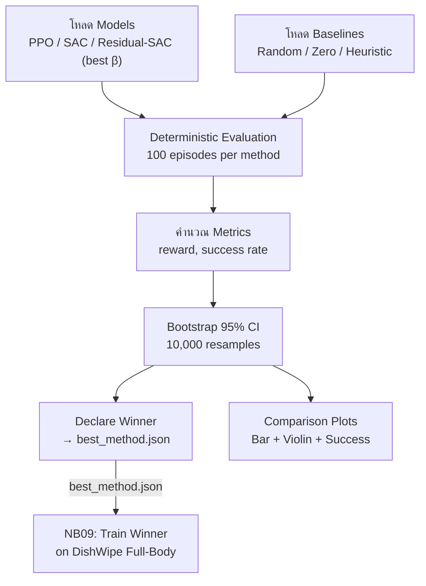
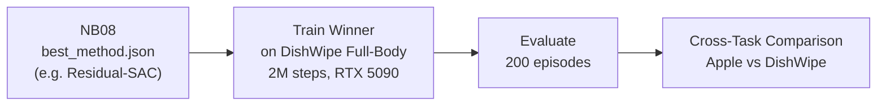

# 07 — Evaluation & Reporting

> เอกสารนี้อธิบาย evaluation pipeline (NB08) และ bonus (NB09)

---

## สารบัญ

- [ภาพรวม Evaluation Pipeline](#ภาพรวม-evaluation-pipeline)
- [Metrics ที่ประเมิน](#metrics-ที่ประเมิน)
- [Deterministic Evaluation](#deterministic-evaluation)
- [Bootstrap Confidence Interval](#bootstrap-confidence-interval)
- [Comparison Plots](#comparison-plots)
- [Winner Declaration](#winner-declaration)
- [Bonus: DishWipe Cross-Task (NB09)](#bonus-dishwipe-cross-task-nb09)
- [วิธีอ่านผลลัพธ์](#วิธีอ่านผลลัพธ์)
- [Troubleshooting](#troubleshooting)

---

## ภาพรวม Evaluation Pipeline



### Methods ที่ประเมิน (NB08)

| Method | Source | Episodes |
|--------|--------|----------|
| PPO | `artifacts/NB05/ppo_apple.zip` | 200 |
| SAC | `artifacts/NB06/sac_apple.zip` | 200 |
| Residual-SAC (best β) | `artifacts/NB07/` + `best_beta.json` | 200 |

---

## Metrics ที่ประเมิน

### Primary Metrics (Apple Task)

| Metric | คำอธิบาย | ดียิ่งขึ้นเมื่อ |
|--------|---------|------------|
| **mean_reward** | reward รวมเฉลี่ยต่อ episode | สูง ↑ |
| **success_rate** | สัดส่วน episode ที่วาง apple ในชามสำเร็จ | สูง ↑ |
| **mean_steps** | จำนวน step เฉลี่ยต่อ episode | ต่ำ ↓ (ถ้า success) |

### Additional Metrics (DishWipe Bonus - NB09)

| Metric | คำอธิบาย | ดียิ่งขึ้นเมื่อ |
|--------|---------|------------|
| **cleaned_ratio** | สัดส่วนจานที่สะอาด (0-1) | สูง ↑ |
| **success_rate** | cleaned ≥ 0.95 | สูง ↑ |

---

## Deterministic Evaluation

ตอน training, policy มี noise/stochasticity เพื่อ explore
ตอน eval ต้องใช้ **deterministic** เพื่อ reproducible + fair

| Algorithm | Deterministic Mode |
|-----------|--------------------|
| **PPO** | Mode ของ distribution (action ที่ probability สูงสุด) |
| **SAC** | Mean ของ Gaussian (ไม่ sample) |
| **Residual SAC** | SAC mean + BaseController ค่าปกติ |

```python
action, _ = model.predict(obs, deterministic=True)
```

---

## Bootstrap Confidence Interval

### Bootstrap CI คืออะไร?

เมื่อรัน 200 episodes ได้ค่าเฉลี่ย — แต่ค่านี้อาจผันผวน
Bootstrap CI บอก "ค่าจริงน่าจะอยู่ในช่วงนี้ด้วยความมั่นใจ 95%"

### สูตร (Percentile Bootstrap)

ให้ $X = [x_1, x_2, \ldots, x_n]$ เป็น metric จาก $n=200$ episodes:

1. **Resample**: สุ่ม $n$ ตัวอย่าง (with replacement) → $X^*$
2. คำนวณ: $\bar{x}^* = \text{mean}(X^*)$
3. ทำซ้ำ $B = 50{,}000$ ครั้ง
4. เรียงลำดับ → ตัดที่ 2.5% และ 97.5%

$$\text{CI}_{95\%} = \left[ \bar{x}^*_{(0.025B)}, \; \bar{x}^*_{(0.975B)} \right]$$

### ตัวอย่างผล
```
PPO:          mean_reward = 3.45 (95% CI: [2.89, 4.01])
SAC:          mean_reward = 5.12 (95% CI: [4.56, 5.68])
Residual-SAC: mean_reward = 6.78 (95% CI: [6.12, 7.44])
```
→ ถ้า CI ไม่ overlap = แตกต่างกันอย่างมีนัยสำคัญ

### Code

```python
def bootstrap_ci(data, n_bootstrap=50000, ci=0.95):
    data = np.array(data)
    boot_stats = [np.mean(np.random.choice(data, len(data), replace=True))
                  for _ in range(n_bootstrap)]
    lower = np.percentile(boot_stats, (1-ci)/2 * 100)
    upper = np.percentile(boot_stats, (1+ci)/2 * 100)
    return lower, upper
```

---

## Comparison Plots

NB08 สร้าง 3 plots:

### Plot 1: Mean Reward with 95% CI
- Bar chart: PPO vs SAC vs Residual-SAC
- Error bars = 95% CI
- ไฟล์: `comparison_plot.png`

### Plot 2: Success Rate
- Bar chart: success rate per method
- ไฟล์: `success_rate_plot.png`

### Plot 3: Reward Distribution
- Violin plot showing full distribution of rewards
- ไฟล์: `reward_distribution.png`

### Plot 4: Statistical Tests
- Welch's t-test p-values + Cohen's d effect sizes for all method pairs
- ไฟล์: `stat_tests.json`

---

## Winner Declaration

NB08 ประกาศผู้ชนะใน `best_method.json`:

```json
{
    "winner": "Residual-SAC",
    "mean_reward": 6.78,
    "ci95": [6.12, 7.44],
    "success_rate": 0.45,
    "reason": "Highest mean reward (6.78) over 100 episodes"
}
```

### เกณฑ์การตัดสิน
1. **Primary**: Mean reward สูงสุด
2. **Tie-break**: Success rate สูงสุด
3. **Note**: ถ้า CI overlap → ไม่มีนัยสำคัญ (บันทึกไว้ใน report)

---

## Bonus: DishWipe Cross-Task (NB09)

NB09 ใช้ winner จาก NB08 มาเทรนบน DishWipe:



### Cross-Task Comparison Table

| Task | Method | mean_reward | success_rate |
|------|--------|------------|-------------|
| Apple | Residual-SAC | 6.78 | 0.45 |
| DishWipe | Residual-SAC | X.XX | X.XX |

> ช่วยบอกว่า method ที่ดีที่สุดสำหรับ Apple ทำได้ดีแค่ไหนกับงาน DishWipe

---

## วิธีอ่านผลลัพธ์

### อ่าน comparison_table.csv

```
method          mean_reward  std_reward  ci95_lo  ci95_hi  success_rate
PPO             3.45         1.23        2.89     4.01     0.15
SAC             5.12         0.89        4.56     5.68     0.32
Residual-SAC    6.78         1.05        6.12     7.44     0.45
```

**แปลผล:**
- Residual-SAC ดีที่สุด (mean_reward สูงสุด)
- CI ของ Residual-SAC ไม่ overlap กับ PPO → แตกต่างอย่างมีนัยสำคัญ
- SAC กับ Residual-SAC อาจ overlap → ความแตกต่างไม่ชัด

### อ่าน best_method.json

- `winner`: ชื่อ method ที่ NB09 จะใช้
- `mean_reward`: ผล Apple task
- `ci95`: ช่วงความเชื่อมั่น

---

## Troubleshooting

| ปัญหา | สาเหตุ | วิธีแก้ |
|-------|--------|--------|
| Model load error | path ผิด หรือ version ไม่ตรง | ตรวจ artifacts path, SB3 version |
| eval แล้ว success=0 ทุก method | training ไม่ converge | ตรวจ learning curve, เพิ่ม steps |
| Residual-SAC eval ผิด | ลืม ResidualActionWrapper | ต้อง wrap env เหมือนตอน train |
| CI กว้างมาก | variance สูง / 200 eps อาจไม่พอ | ลอง 300 episodes |
| NB09 fail | DishWipe env ยังไม่สร้าง | สร้าง `dishwipe_fullbody_env.py` ก่อน |
| DishWipe "500K steps" | ค่าเก่า, ตอนนี้ใช้ 2M steps | ตรวจ config ใน NB09 |

---

*อัปเดตล่าสุด: มีนาคม 2026 | Full-Body G1 — Apple (NB08) + DishWipe Bonus (NB09)*
