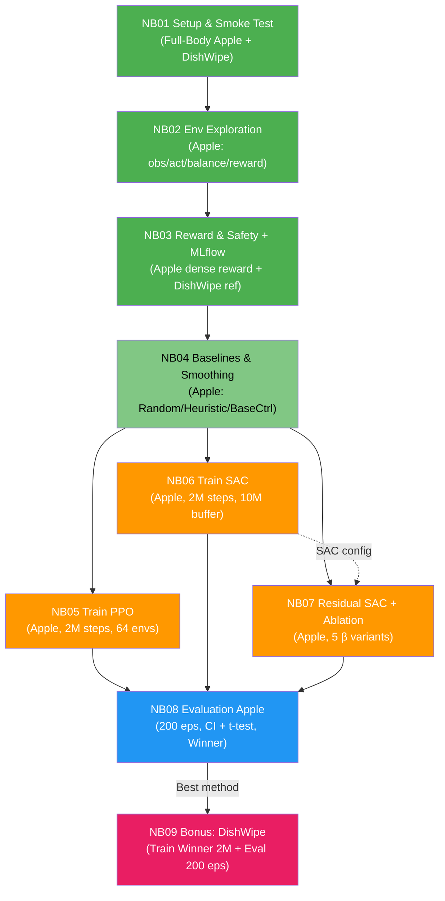

# Revised Plan v4: Full-Body Unitree G1 — Apple (Main) + DishWipe (Bonus)

> **Status: PLANNING** — Restructured for Full-Body G1 (37 DOF) on both tasks.
> **Hardware: NVIDIA RTX 5090 (32 GB VRAM) + 40 GB RAM**
> Updated: March 2026

---

## Overview

| | **Task A: PlaceAppleInBowl (Main)** | **Task B: DishWipe (Bonus)** |
|---|---|---|
| Env ID | `UnitreeG1PlaceAppleInBowlFullBody-v1` (custom) | `UnitreeG1DishWipeFullBody-v1` (custom) |
| Agent | `unitree_g1` (**37 DOF**, free-floating root) | `unitree_g1` (**37 DOF**, free-floating root) |
| Scene | Kitchen counter + sink + apple + bowl | Kitchen counter + sink + plate |
| Success | Apple ในชามอย่างเสถียร | ล้างจาน ≥ 95% ของ grid |
| ความยาก | **สูงมาก** — balance + multi-step manipulation | สูง — balance + continuous contact |
| Custom Env? | ใช่ — wrap built-in + swap robot to full body | ใช่ — upgrade จาก upper body เป็น full body |
| Notebooks | NB01–NB08 (main pipeline) | NB09 (self-contained bonus) |

### ทำไมต้อง Full Body?

ตามโจทย์อาจารย์: หุ่นยนต์ต้อง **balance ด้วยขาทั้งสองข้าง** ขณะทำ manipulation
- `unitree_g1` (37 DOF, free root) — ขา 12 joints + torso 1 + แขน 10 + นิ้ว 14
- ต้อง coordinate ทั้งตัว: ขาทรงตัว + แขนทำงาน
- `is_fallen()` / `is_standing()` ใช้ตรวจ balance

### ทำไม DishWipe เป็น Bonus?

- ลด GPU budget ~40-50% (train แค่ best method จาก Apple evaluation)
- Apple เป็น main task ที่ตรงโจทย์อาจารย์ (หยิบ-วาง + balance)
- DishWipe แสดง transferability ของ best method ข้าม task

---

## Hardware Platform: RTX 5090

| Spec | Value | Utilization Strategy |
|------|-------|---------------------|
| GPU | NVIDIA RTX 5090 | Full CUDA acceleration |
| VRAM | **32 GB** | GPU-vectorized envs (64 parallel), large replay buffers on GPU |
| RAM | **40 GB** | 10M replay buffer, multi-env observations |
| CUDA Cores | ~21,760 | Massive parallel simulation via ManiSkill GPU backend |
| Architecture | Blackwell | FP16/BF16 mixed precision training |

### RTX 5090 Optimization Strategy

1. **GPU-Vectorized Simulation**: ManiSkill `sim_backend="gpu"` with `num_envs=64`
2. **Large Training Budget**: 2M env steps per method (4× previous 500K)
3. **Wider Networks**: `net_arch=[512, 512]` with `ReLU` hidden + `Tanh` output squashing
4. **Large Replay Buffer**: SAC buffer 10M transitions (~5-8 GB in RAM)
5. **Large Batch Size**: PPO batch=2048, SAC batch=1024
6. **Mixed Precision**: `torch.cuda.amp` for 30-40% speedup
7. **Linear LR Decay**: Warm-start → linear decay to 1e-5
8. **Observation Normalization**: `VecNormalize` wrapper for stable training
9. **Checkpointing**: Save every 200K steps for recovery
10. **Extended β Ablation**: β ∈ {0.1, 0.25, 0.5, 0.75, 1.0} (5 variants)
11. **200-Episode Evaluation**: Statistical tests (Welch's t-test, Cohen's d)
12. **Video Recording**: Record best/worst episodes as MP4

---

## Budget Comparison

| | แผนเดิม (RTX 4090) | แผนใหม่ (RTX 5090) | Improvement |
|---|---|---|---|
| Training budget | 500K steps × 3 methods | **2M steps × 3 methods** | **4× steps** |
| Parallel envs (PPO) | 4 | **64** | **16×** |
| Network size | [256, 256] = 197K params | **[512, 512] = 790K params** | **4× capacity** |
| SAC buffer | 1M transitions | **10M transitions** | **10×** |
| β variants | 3 (0.25, 0.5, 1.0) | **5 (0.1, 0.25, 0.5, 0.75, 1.0)** | +2 variants |
| Eval episodes | 100 | **200** | **2× statistical power** |
| Batch size | 256 | **PPO: 2048, SAC: 1024** | **4-8×** |
| GPU time (Apple) | ~8-12 ชม. | **~4-6 ชม.** (64 envs faster) | **2× faster** |
| Total training runs | 5 | **8** (5 β + PPO + SAC + DishWipe) | More comprehensive |

---

## Notebook Pipeline



> 🟢 CPU | 🟠 GPU (RTX 5090) | 🔵 CPU/GPU

---

## Pipeline Summary Table

| NB | ชื่อ | Task | HW | Key Focus | Key RTX 5090 Upgrade |
|----|------|------|-----|-----------|---------------------|
| NB01 | Setup & Smoke Test | Both | CPU | Register envs, verify obs/act | GPU detection + VRAM report |
| NB02 | Env Exploration | Apple | CPU | Obs breakdown, balance analysis | 30-episode deeper analysis |
| NB03 | Reward & Safety + MLflow | Apple (+DW ref) | CPU | Dense reward, safety validation | 20-episode reward validation |
| NB04 | Baselines & Smoothing | Apple | CPU→GPU | Baselines, SmoothWrapper, BaseCtrl | 50-episode eval per baseline |
| NB05 | Train PPO | Apple | **GPU** | SB3 PPO, VecNormalize, checkpoints | **2M steps, 64 envs, [512,512], LR decay** |
| NB06 | Train SAC | Apple | **GPU** | SB3 SAC, 10M buffer, auto-entropy | **2M steps, 10M buffer, [512,512], 1024 batch** |
| NB07 | Residual SAC + β Ablation | Apple | **GPU** | BaseCtrl + β×SAC, 5 variants | **5 β values, 2M steps each** |
| NB08 | Evaluation Apple | Apple | GPU | CI, t-test, Cohen's d, video | **200 eps, Welch's t-test, video recording** |
| NB09 | Bonus: DishWipe | DishWipe | **GPU** | Train winner + eval | **2M steps + 200-episode eval** |

---

## Reward Functions

### Task A: Apple (Full-Body) — Dense Staged Reward

| Stage | Condition | Reward | Max |
|-------|-----------|--------|-----|
| 0. Reaching | dist(hand, apple) | `1 - tanh(5 * dist)` | ~1.0 |
| 1. Grasping | hand is grasping apple | +1.0 bonus | 1.0 |
| 2. Placing | dist(apple, bowl) while grasped | `1 - tanh(5 * dist)` | ~1.0 |
| 3. Releasing | apple in bowl + hand released | +5.0 bonus | 5.0 |
| **+ Balance** | `is_standing()` | penalty if fallen | — |
| **Max total** | | | **~10** |

### Task B: DishWipe (Full-Body) — 9-Term + Balance

| Term | Weight | Formula | Sign |
|------|--------|---------|------|
| r_clean | 10.0 | delta_clean | + |
| r_reach | 0.5 | 1 - tanh(5 * dist) | + |
| r_contact | 1.0 | is_contacting | + |
| r_sweep | 0.3 | lateral_movement | + |
| r_time | 0.01 | -w per step | - |
| r_jerk | 0.05 | -w * jerk² | - |
| r_act | 0.005 | -w * action_norm² | - |
| r_force | 0.01 | -w * excess_force | - |
| r_success | 50.0 | one-shot at 95% | + |
| **r_balance** | **TBD** | **penalty for torso tilt** | **-** |
| **r_fall** | **TBD** | **terminate if fallen** | **-** |

---

## Fairness Constraints (Apple — Main Task)

| Parameter | Value | Why |
|-----------|-------|-----|
| `TOTAL_ENV_STEPS` | **2,000,000** (GPU) / 20K (CPU demo) | Same budget for all methods |
| `EVAL_EPISODES` | **200** (deterministic) | High statistical power + bootstrap + t-test |
| `SEEDS` | [42, 123, 456] | Reduce variance |
| `net_arch` | **[512, 512]** + ReLU hidden | Same network capacity for all |
| `robot` | `unitree_g1` (37 DOF) | Same robot for all |
| `control_mode` | `pd_joint_delta_pos` | Same control mode |
| `obs_normalization` | `VecNormalize` (`clip_obs=10`) | Same normalization for all |
| `lr_schedule` | Linear decay: 3e-4 → 1e-5 | Same schedule for all |
| `mixed_precision` | FP16 via `torch.cuda.amp` | Same numerics for all |

---

## Source Code Architecture

```
src/envs/
├── __init__.py                    ← Register both envs
├── apple_fullbody_env.py          ← 🆕 Full-body Apple env (wraps ManiSkill)
├── dishwipe_fullbody_env.py       ← 🔧 Full-body DishWipe (from dishwipe_env.py)
├── dishwipe_env.py                ← Original upper-body DishWipe (kept for ref)
└── dirt_grid.py                   ← VirtualDirtGrid (unchanged)
```

### Key Technical Details — Full Body

| Property | Upper Body (old) | Full Body (new) |
|----------|-----------------|-----------------|
| Robot UID | `unitree_g1_simplified_upper_body` | `unitree_g1` |
| DOF | 25 | **37** (+12 leg joints) |
| Root | Fixed | **Free-floating** |
| Obs (Apple) | ~60-80D | **~100-120D** |
| Obs (DishWipe) | ~168D | **~192D** |
| Action | 25D (upper) | **37D** (full) |
| Balance | Not needed | **Required** |
| URDF | `g1_upper_body.urdf` | `g1.urdf` |

---

## RTX 5090 Training Hyperparameters (Final)

### PPO (NB05)

| Parameter | Value | Rationale |
|-----------|-------|-----------|
| `total_env_steps` | 2,000,000 | 4× original, fills RTX 5090 capacity |
| `n_envs` | 64 | GPU-vectorized, fully utilizes RTX 5090 |
| `n_steps` | 512 | Rollout per env (total rollout = 64 × 512 = 32,768) |
| `batch_size` | 2048 | Large batch for stable gradients |
| `n_epochs` | 10 | Standard PPO |
| `learning_rate` | 3e-4 → 1e-5 | Linear decay |
| `gamma` | 0.99 | Standard discount |
| `gae_lambda` | 0.95 | Standard GAE |
| `clip_range` | 0.2 | Standard PPO clip |
| `ent_coef` | 0.005 | Encourages exploration in high-dim action |
| `vf_coef` | 0.5 | Value function coefficient |
| `max_grad_norm` | 0.5 | Gradient clipping |
| `net_arch` | [512, 512] | 4× capacity for 37 DOF |
| `activation_fn` | ReLU | Better gradient flow for deep nets |
| `normalize_advantage` | True | Stabilizes training |

### SAC (NB06)

| Parameter | Value | Rationale |
|-----------|-------|-----------|
| `total_env_steps` | 2,000,000 | Same budget as PPO |
| `n_envs` | 1 | Off-policy, single env sufficient |
| `buffer_size` | 10,000,000 | ~5-8 GB, fits in 40 GB RAM |
| `batch_size` | 1024 | Large batch, GPU-friendly |
| `tau` | 0.005 | Soft target update |
| `gamma` | 0.99 | Standard |
| `ent_coef` | "auto" | Auto-tuned (optimal for exploration) |
| `target_entropy` | "auto" | -dim(A) default |
| `learning_starts` | 10,000 | Fill buffer before training |
| `train_freq` | 1 | Update every step |
| `gradient_steps` | 2 | 2 gradient steps per env step |
| `learning_rate` | 3e-4 → 1e-5 | Linear decay |
| `net_arch` | [512, 512] | Same capacity as PPO |

### Residual SAC (NB07)

| Parameter | Value | Rationale |
|-----------|-------|-----------|
| β values | {0.1, 0.25, 0.5, 0.75, 1.0} | 5 variants, comprehensive ablation |
| Per-variant budget | 2,000,000 | Same as vanilla SAC |
| Total GPU budget | 10,000,000 | 5 × 2M (RTX 5090 can handle it) |
| SAC config | Inherited from NB06 | Fairness |
| `smooth_alpha` | 0.3 | EMA coefficient for BaseController |

---

## Timeline (RTX 5090)

| Phase | Notebooks | HW | Est. Time |
|-------|-----------|-----|-----------|
| Setup & Exploration | NB01–NB04 | CPU | 0.5-1 day |
| Training (Apple, 3 methods) | NB05–NB07 | RTX 5090 | 1-2 days |
| Evaluation Apple | NB08 | RTX 5090 | 0.5 day |
| Bonus DishWipe | NB09 | RTX 5090 | 0.5 day |
| **Total** | | | **~2-4 days** |

---

## MLflow Structure

```
Experiment: "g1_fullbody_apple_dishwipe"
├── NB01_setup_smoke
├── NB02_env_exploration
├── NB03_reward_safety
├── NB04_baselines
├── NB05_ppo_apple           (params: 2M steps, 64 envs, [512,512])
├── NB06_sac_apple           (params: 2M steps, 10M buffer, [512,512])
├── NB07_residual_sac_b0.10  (params: β=0.10)
├── NB07_residual_sac_b0.25  (params: β=0.25)
├── NB07_residual_sac_b0.50  (params: β=0.50)
├── NB07_residual_sac_b0.75  (params: β=0.75)
├── NB07_residual_sac_b1.00  (params: β=1.00)
├── NB08_eval_apple          (200 eps, CI, t-test, Cohen's d)
└── NB09_bonus_dishwipe      (2M steps + 200-ep eval)
```

---

*Plan v4 — RTX 5090 Edition — Updated March 2026*
