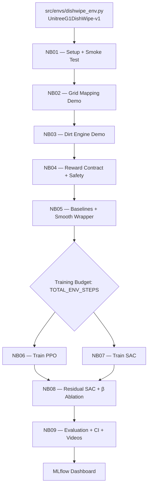

# Revised Plan: Custom Environment for Unitree G1 DishWipe (v2)

> **Status: IMPLEMENTED** — All notebooks (NB01–NB09) and env code are complete.

## Environment v2 Summary

| Property | Value |
|----------|-------|
| Env ID | `UnitreeG1DishWipe-v1` |
| Agent | `unitree_g1_simplified_upper_body` (25 DOF, fixed root) |
| Scene | Kitchen counter + sink + plate (plate inside sink basin, kinematic) |
| Obs dim | **~168** (qpos 25 + qvel 25 + TCP 3 + palm 3 + plate 3 + palm_to_plate 3 + contact 1 + cleaned_ratio 1 + dirt_grid 100 + extras 4) |
| Act dim | **25** (pd_joint_delta_pos) |
| Contact | **Multi-link**: left_palm_link + left_two_link + left_four_link + left_six_link ↔ plate |
| Dirt mapping | Force-weighted centroid of contacting links → grid cell |
| Reach reward | `dist(palm, plate)` — uses **palm** position (not TCP) |
| Sweep reward | `W_SWEEP=0.3` — bonus for lateral movement while in contact |

### Architecture

```
src/envs/
  __init__.py
  dishwipe_env.py    ← Custom ManiSkill env (~430 lines)
  dirt_grid.py       ← VirtualDirtGrid module (~145 lines)
```

---

## Reward Function (9 terms)

| Term | Weight | Formula | Sign |
|------|--------|---------|------|
| r_clean | W_CLEAN=10.0 | w × delta_clean | + |
| r_reach | W_REACH=0.5 | w × (1 − tanh(5 × dist(palm, plate))) | + |
| r_contact | W_CONTACT=1.0 | w × is_contacting | + |
| r_sweep | W_SWEEP=0.3 | w × ‖centroid_t − centroid_{t-1}‖ | + |
| r_time | W_TIME=0.01 | −w (constant per step) | − |
| r_jerk | W_JERK=0.05 | −w × ‖a_t − a_{t-1}‖² | − |
| r_act | W_ACT=0.005 | −w × ‖a_t‖² | − |
| r_force | W_FORCE=0.01 | −w × max(0, F_contact − F_soft) | − |
| r_success | SUCCESS_BONUS=50.0 | one-shot when cleaned ≥ 95% | + |

### Termination
- **Success**: cleaned_ratio ≥ 0.95
- **Force limit**: contact_force > FZ_HARD (200 N)
- **Timeout**: steps ≥ 1000

---

## Notebook Pipeline



| NB | Status | HW | Key Focus |
|----|--------|-----|-----------|
| NB01 | ✅ CPU-tested | CPU | Register env, verify obs (168D), act (25D), TCP, palm, contact, dirt grid |
| NB02 | ✅ CPU-tested | CPU | Grid mapping: world_to_uv → uv_to_cell, contact detection, zig-zag path |
| NB03 | ✅ CPU-tested | CPU | Dirt engine: brush radius, cleanup progress, plotting |
| NB04 | ✅ CPU-tested | CPU | Reward contract v2 (9 terms incl. r_sweep), safety validation, MLflow helpers |
| NB05 | ✅ CPU-tested | CPU | Random/heuristic baselines, SmoothActionWrapper, BaseController |
| NB06 | Ready | GPU | Train PPO (SB3), CPUGymWrapper, learning curve |
| NB07 | Ready | GPU | Train SAC (SB3), same wrappers as NB06 |
| NB08 | Ready | GPU | Residual SAC: BaseController + β-scaled residual, ablation β∈{0.25,0.5,1.0} |
| NB09 | Ready | CPU/GPU | Eval all methods, bootstrap CI, comparison plots, video |

---

## Key Technical Details

### Multi-link Contact
The env queries `scene.get_pairwise_contact_forces()` for 4 links against the plate:
- `left_palm_link`, `left_two_link`, `left_four_link`, `left_six_link`
- Computes a **force-weighted centroid** for dirt-grid mapping
- Total contact force (scalar, L2 magnitude not Fz) exposed in `info["contact_force"]`

### Palm vs TCP
- **TCP** (`agent.left_tcp`): available but offset ~7cm X, 3.5cm Y from palm
- **Palm** (`agent.robot.links_map["left_palm_link"]`): used for reach reward
- Heuristic policies in NB05/NB08/NB09 target **palm** position

### SB3 Wrappers
- `CPUGymWrapper`: converts ManiSkill batched obs `(1, D)` to standard `(D,)`
- `ManiSkillVectorEnv`: for GPU multi-env (num_envs > 1)

### Exported Constants
```python
from src.envs.dishwipe_env import (
    PLATE_HALF_SIZE, PLATE_POS_IN_SINK,
    GRID_H, GRID_W, BRUSH_RADIUS,
    W_CLEAN, W_REACH, W_CONTACT, W_SWEEP,
    W_TIME, W_JERK, W_ACT, W_FORCE,
    SUCCESS_BONUS, FZ_SOFT, FZ_HARD,
    SUCCESS_CLEAN_RATIO, CONTACT_THRESHOLD,
    KITCHEN_SCENE_SCALE, _LEFT_CONTACT_LINKS,
)
```

---

## MLflow
- Tracking URI: configured via `.env.local` → `MLFLOW_TRACKING_URI`
- Experiment: `dishwipe_unitree_g1`
- Each notebook logs its own run (NB01_setup, NB02_grid_mapping, etc.)
